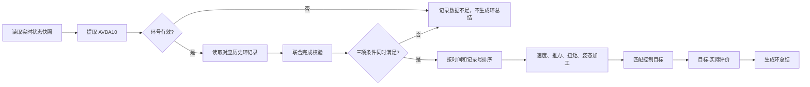

# 盾构播报机器人设计方案 3.0

## 1. 目标与边界

盾构播报机器人是隧道掘进智能体中的实时信息服务模块，负责把盾构管控平台产生的实时状态、环级历史数据、控制目标和历史报警文本，转换为可听、可读、可追溯的现场播报。

播报输出分为两条相互独立的链路：

1. **环总结播报**：当前环满足推进完成判定后，生成该环的工况总结和控制效果评价。
2. **安全预警播报**：实时状态、控制评价或数据质量达到预警触发条件时生成；不要求每一环固定输出。

模块只负责事实整理、指标计算、风险提示和自然语言表达，不执行数据修改操作。

安全相关播报必须保留人工介入边界：

> 该条播报不代表最终安全裁决，请现场人员介入判断。

## 2. 业务对象与输出关系

### 2.1 环总结播报

环总结面向司机、现场人员和管理人员，回答以下问题：

- 哪一环被识别为完成；
- 本环速度、推力和扭矩总体表现如何；
- 姿态是否向目标靠近、基本稳定或出现偏离；
- 目标与实际控制效果是否一致；
- 哪些结果暂时不能评价，原因是什么。

环总结只描述当前结束环，不承担其他环段的施工预报。已经发生的安全事件由安全预警链路单独播报；如需要在环总结中保留关联信息，只允许保留“存在关注事项”这一概述。

### 2.2 安全预警播报

安全预警只在触发条件成立时输出，并在出现安全预警实践的环总结播报中体现，重点说明：

- 风险对象；
- 触发依据；
- 历史同类报警文本参考；
- 现场需要核对的对象；
- 人工介入边界。

没有触发条件时，不生成风险性结论。

## 3. 数据来源与运行边界

### 3.1 真实应用数据来源

工程部署时，输入数据来自盾构管控平台的实时掘进数据、历史掘进数据、控制目标配置和报警事件接口。接口适配层需要保持下列逻辑对象的字段语义一致：

| 逻辑对象 | 工程用途 |
| --- | --- |
| 实时状态快照 | 确定当前环号、推进状态、行程和实时报警位 |
| 历史环记录 | 还原指定环的连续掘进过程并进行环级统计 |
| 控制目标记录 | 提供速度、推力、扭矩和姿态的规划目标 |
| 历史报警样本 | 提供同类风险的文字表达和历史分类参考 |

本地 MySQL 数据库用于开发、联调和只读验证，不能替代真实盾构管控平台接口。

### 3.2 数据访问边界

数据访问层使用只读连接读取以下四张表：

| 表 | 读取内容 | 作用 |
| --- | --- | --- |
| `mb_data_auto` | 最新实时状态快照 | 确定当前环号、完成状态、推进行程和实时报警位 |
| `mb_data_his_auto` | 指定环的历史记录 | 计算速度、推力、扭矩和姿态的环级指标 |
| `config_target_manage` | 环号范围、控制目标、姿态目标 | 形成目标-实际控制效果评价 |
| `alarm_record` | 历史报警字段及 `alarm_desc` | 触发后检索同类历史文本，辅助风险表达 |

部署时应在程序中修改联调连接参数：

```text
host=
port=
user=
password=
database=
```

连接适配层应允许配置主机、端口、用户名、密码、数据库名和四张表名。更换数据源时，必须同时确认表存在、字段语义一致、账号具备只读权限，并完成字段和数据类型检查。任何环境均不得执行写入、结构变更、导入或删除操作。

### 3.3 数据源与责任边界

实时表只说明“当前状态是什么”，历史表用于“该环实际经历了什么”。实时快照不能单独还原完整环过程，因此环总结在完成条件成立后必须读取对应的历史记录。控制目标表只提供规划目标，不负责给出最终安全裁决。报警表只提供历史样本，实时触发由实时状态和规则判断负责。

## 4. 字段用途

### 4.1 环号、时间和进度字段

| 字段 | 用途 | 输出或判断 |
| --- | --- | --- |
| `AVBA10` | 唯一环号来源；实时、历史和目标匹配均以此为准 | 确定播报环号和历史查询条件。 |
| `localtime1` | 快照时间、历史记录排序和事件时间参考 | 形成时间顺序，不直接作为安全结论 |
| `id` | 同一时间下的稳定排序辅助字段 | 仅用于排序和追溯 |
| `AVBA02` | 里程或位置记录 | 形成环级里程起点和终点 |
| `ATBA02` | 推进净行程 | 形成推进量，并参与完成校验 |
| `ATMD02` | 推进结束状态校验字段 | 与 `ATBA02` 组成完成判定 |

### 4.2 速度、推力和扭矩字段

| 字段 | 用途 | 加工结果 |
| --- | --- | --- |
| `ATPA21`、`ATPA22`、`ATPA23`、`ATPA24` | 四个分区的推进速度采样 | 每条记录先形成有效分区均值，再形成环均值 |
| `ATBA03` | 总推力采样 | 环均值、起始样本段均值、末段样本段均值、有效率 |
| `ACBA03` | 刀盘扭矩采样 | 环均值、起始样本段均值、末段样本段均值、有效率 |

推力和扭矩的空值不参与数值计算。零值会被记录为数据质量信息；在环级均值和目标评价中，零值不作为推进阶段的正常有效值。不得仅凭零值直接判定设备异常，必须结合推进状态、行程和同环记录上下文解释。

速度处理规则为：

```text
单条记录速度 = 有效的 ATPA21-24 数值均值
环平均速度 = 所有有效单条记录速度的均值
```

某条记录只有一个分区有效时，使用该条记录的有效值，并保留有效分区数量。速度目标评价在单位和业务含义确认前关闭，仍可播报采集到的平均速度。

### 4.3 姿态字段

| 方向 | 前端/切口 | 后端/盾尾 | 用途 |
| --- | --- | --- | --- |
| 水平 | `AVSA01` | `AVSA11` | 计算水平姿态起止状态和目标距离变化 |
| 垂直 | `AVSA02` | `AVSA12` | 计算垂直姿态起止状态和目标距离变化 |

`config_target_manage.horizontal_pos` 和 `vertical_pos` 的工程含义为：

```text
1 -> 前端/切口
0 -> 后端/盾尾
```

### 4.4 控制目标字段

| 字段 | 用途 |
| --- | --- |
| `ring_start`、`ring_end` | 按环号筛选目标记录 |
| `speed_start`、`speed_end` | 速度规划区间端点；速度比较默认关闭 |
| `thrust_start`、`thrust_end` | 总推力规划区间端点 |
| `torque_start`、`torque_end` | 刀盘扭矩规划区间端点 |
| `horizontal_segment_pos`、`vertical_segment_pos` | 水平、垂直目标位置的段信息 |
| `horizontal_pos`、`vertical_pos` | 选择参与姿态评价的端点 |
| `horizontal_pos_dist`、`vertical_pos_dist` | 选定端点的目标位置或目标偏差 |
| `update_date`、`id` | 目标重叠时确定最新有效记录 |

目标字段的 `start/end` 解释为规划区间端点，`end` 是本环结束阶段的主要目标。

### 4.5 报警字段

| 字段 | 用途 |
| --- | --- |
| `alarm_desc` | 安全预警主要文字来源 |
| `alarm_type` | 辅助区分报警类别 |
| `alarm_level` | 作为历史等级参考，不直接替代实时风险判断 |
| `alarm_field` | 与实时报警位或风险对象进行匹配 |
| `alarm_status` | 过滤历史解除或无效记录；非零状态不作为新的文本样本 |
| `alarm_start`、`alarm_end` | 参考历史事件时间和持续状态 |
| `alarm_subtype` | 辅助区分报警子类和检索范围 |
| `alarm_md5` | 历史样本识别和追溯，不作为当前重复拦截条件 |
| `is_tips`、`flag_cls`、`shield_stop` 等 | 作为历史分类或处置提示参考，不单独触发实时预警 |

历史报警文本可能以二进制或十六进制形式存储，文本接入前需要解码并去除历史环号、历史时间等不应直接复制到当前播报中的内容。

## 5. 环总结播报链路



### 5.1 当前待总结环识别

按实时表时间倒序、记录号倒序读取最新快照，将其中有效的 `AVBA10` 作为当前待总结环。

### 5.2 推进完成联合判定

环总结触发采用“与”逻辑，三个条件必须同时满足：

```text
AVBA10 有效
AND ATMD02 = 1
AND ATBA02 >= 配置的推进净行程校验值
AND mb_data_his_auto 存在该 AVBA10 的历史记录
```

其中前三项用于确认当前状态和推进完成，历史记录存在用于确认具备环级评价的数据基础。任意一项不满足，都不生成确定性的环总结。

### 5.3 历史环读取

完成条件成立后，按 `AVBA10` 查询历史环记录，并按以下顺序排序：

```text
localtime1 ASC
id ASC
```

每个指标独立过滤空值、不可转换值和不参与统计的零值。某一个字段缺失不应导致所有指标丢弃；但核心字段有效性不足时，相关评价必须降级。

### 5.4 环级加工

每个待总结环形成以下内部结果：

| 加工对象 | 结果 |
| --- | --- |
| 环记录 | 记录数、时间范围、里程起止、推进净行程最大值 |
| 平均速度 | ATPA21-24 单条有效均值，再求环均值、最小值、最大值和有效样本数 |
| 总推力 | 环均值、最大值、起始样本段均值、末段样本段均值、有效率、零值数量 |
| 刀盘扭矩 | 环均值、最大值、起始样本段均值、末段样本段均值、有效率、零值数量 |
| 姿态 | 前端/后端水平和垂直起止均值、目标距离变化 |

起始样本段和末段样本段只用于控制效果评价与质量判断。播报正文只输出加工后的平均值和结论，不输出分区字段均值、样本窗口名称或内部统计参数。

## 6. 控制目标与实际效果评价

### 6.1 目标匹配

对环号 `R` 筛选：

```text
ring_start <= R <= ring_end
```

目标范围重叠时，按 `update_date DESC, id DESC` 选择最新记录。没有匹配目标时，保留环级工况统计，但目标评价为“暂无法评价”。

### 6.2 目标区间解释

`*_start` 与 `*_end` 表示规划区间两端，`*_end` 是本环结束阶段的主要比较目标。实际值优先使用末段样本均值，末段均值不可用时使用环均值。

实际值与规划区间的关系按以下顺序评价：

| 状态 | 判断 |
| --- | --- |
| `below_planning_range` | 实际值低于规划区间下界 |
| `above_planning_range` | 实际值高于规划区间上界 |
| `near_end_target` | 实际值处于区间内且接近 `end` 目标 |
| `within_range_below_end` | 实际值处于区间内但低于 `end` 目标 |
| `within_range_above_end` | 实际值处于区间内但高于 `end` 目标 |
| `unknown` | 实际值或目标区间缺失 |

接近 `end` 的判断使用可配置相对容差，当前联调初始值为 10%，不构成最终安全阈值。

### 6.3 速度评价*

速度只输出 `ATPA21-24` 加工后的平均推进速度。

*速度目标比较暂未运行，原因是采集速度字段与控制目标表速度字段的单位和业务含义仍需确认。确认一致后，才允许启用速度目标比较。在兼容性确认前，禁止输出“速度达标”“速度不达标”等确定性目标结论；可以输出实际平均速度或“速度目标暂无法评价”。

### 6.4 推力与扭矩评价

总推力使用 `ATBA03`，刀盘扭矩使用 `ACBA03`。两者的主要实际比较值均优先取末段样本均值，否则取环均值；规划区间由对应 `start/end` 目标构成。

目标偏离只说明控制效果与规划目标的关系，不直接等同于安全事故。只有当偏离状态被安全规则列为触发条件时，才进入安全预警链路。

### 6.5 姿态控制效果评价

对水平、垂直两个方向分别选择评价端点。端点由目标表的 `horizontal_pos`、`vertical_pos` 决定，`1` 取前端/切口，`0` 取后端/盾尾。

设选定端点的目标值为 `target`，起始样本段均值为 `x_start`，末段样本段均值为 `x_end`：

```text
d_start = abs(x_start - target)
d_end = abs(x_end - target)
distance_improvement = d_start - d_end
```

| 条件 | 结论 |
| --- | --- |
| `distance_improvement > posture_epsilon` | 向目标靠近 |
| `distance_improvement < -posture_epsilon` | 偏离目标，需持续观察 |
| 其余情况 | 基本保持稳定 |
| 任一实际值或目标缺失 | 姿态暂无法评价 |

两个方向中任一项偏离时，整体姿态状态为关注；存在向目标靠近但无偏离项时，整体结论为姿态向目标靠近；两项均稳定时，整体结论为姿态基本稳定。

单环姿态偏离只构成控制效果关注，不自动判定安全事故。连续环趋势和更严格的安全规则应由上层判断模块结合更多实时记录确认。

## 7. 环总结话术结构

### 7.1 简约版

```text
第 {ring_no} 环推进完成。平均推进速度 {speed_mean}，总推力环均值 {thrust_mean}，刀盘扭矩环均值 {torque_mean}。
{posture_conclusion}。{target_conclusions}。
```

### 7.2 详细版

```text
【环完成】
第 {ring_no} 环推进完成，里程由 {mileage_start} 变化至 {mileage_end}，
推进净行程最大值为 {stroke_max}，有效历史记录 {record_count} 条。

【工况与控制效果】
平均推进速度为 {speed_mean}；总推力环均值为 {thrust_mean}；
刀盘扭矩环均值为 {torque_mean}。
目标评价：{target_conclusions}。

【姿态评价】
{posture_conclusion}。
水平：{horizontal_conclusion}；垂直：{vertical_conclusion}。

【数据边界】
{data_quality_conclusion}
```

## 8. 安全预警链路

### 8.1 触发来源

安全预警由实时状态和评价结果触发，历史报警记录不作为实时开关。触发类别如下：

| 类别 | 判断规则 | 风险级别 |
| --- | --- | --- |
| 实时报警位 | 实时快照中字段名匹配 `T` 加五位数字，且值有效 | `T00054` 为警示，其余默认关注 |
| 推力目标偏离 | 总推力评价为低于或高于规划区间 | 关注 |
| 扭矩目标偏离 | 刀盘扭矩评价为低于或高于规划区间 | 关注 |
| 姿态评价关注 | 姿态整体状态为关注 | 关注 |
| 核心数据不足 | 已具备环摘要但核心字段无有效值 | 关注 |
| 环号缺失 | 实时快照无法读取 `AVBA10` | 关注 |
| 指定历史样本接入 | 仅用于历史文本接入验证，不代表历史记录触发实时风险 | 关注 |

正常目标区间内的控制结果不触发安全预警。单纯存在历史报警记录也不触发安全预警。

### 8.2 历史文本检索

触发条件成立后，从 `alarm_record` 中读取 `alarm_status=0` 且 `alarm_desc` 非空的历史样本，优先按以下线索匹配：

1. 当前实时报警位与样本 `alarm_field` 一致；
2. 风险对象关键词出现在 `alarm_desc` 中；
3. `alarm_type`、`alarm_subtype` 和时间字段用于辅助排序和追溯。

`alarm_desc` 是主要文本来源。无法匹配到相关历史文本时，使用受控句式：

> 请按当前触发依据进行现场核对。

历史文本中的历史环号、历史时间和历史具体数值需要归一化，不得直接作为当前事件事实输出。

### 8.3 报警文本重复策略

在内容生成层不执行报警去重、合并或 60 秒降频拦截。每次读取到的状态重新满足预警条件时，都可以重新生成简约版和详细版预警。`alarm_md5` 只用于历史样本识别和追溯，不阻止当前播报。若语音通道需要限频，应在上层播报调度器中配置；上层限频不改变本链路对当前风险的判断。

### 8.4 安全预警话术

**简约版：**

```text
安全预警：{risk_object}出现关注状态，{alarm_desc}。
请现场人员核对{risk_object}及相关工况。该条播报不代表最终安全裁决，请现场人员介入判断。
```

**详细版：**

```text
【安全预警】
{risk_object}当前为{risk_level_text}级预警。

【触发依据】
{event_reasons}。历史同类信息参考为：{alarm_desc}。

【现场判断】
请现场人员核对{risk_object}、实时数据和设备状态，必要时由中枢或判断模块进一步确认。
该条播报不代表最终安全裁决，请现场人员介入判断。
```

## 9. 自然语言生成与事实一致性

采用“结构化计算结果 + 受控模板 + 表达层组织 + 事实检查”的 NLG 路线：

1. 先完成数据有效性检查和指标计算；
2. 再形成环总结或预警事件对象；
3. 根据播报类型和详细程度填充模板；
4. 对数值、环号、风险对象、目标评价和历史文本进行事实一致性检查；
5. 对缺失、单位未确认和无法评价的项目使用受控表达；
6. 最后输出文本播报和结构化结果。

## 10. 数据质量处理

| 数据问题 | 处理方式 |
| --- | --- |
| `AVBA10` 缺失 | 不生成确定性环总结；可生成环号数据质量预警 |
| `ATMD02` 不等于 1 | 不通过推进完成校验 |
| `ATBA02` 缺失或低于配置校验值 | 不通过推进完成校验 |
| 指定环历史数据不存在 | 不生成确定性环总结 |
| 目标记录不存在 | 保留工况统计，目标评价为暂无法评价 |
| 速度分区部分缺失 | 使用有效分区均值并保留有效样本信息 |
| 推力或扭矩有效值不足 | 相关评价降级，不将零值直接判定为正常 |
| 姿态目标或实际值缺失 | 对相应方向输出暂无法评价 |
| 速度单位未确认 | 只输出实际平均速度，关闭速度目标比较 |
| 历史报警文本不存在 | 使用受控现场核对句式 |

数据质量状态必须能够追溯到字段、记录数量和具体缺失原因，但现场话术只输出必要的可理解结论。

## 11. 程序输出检查

| 编号 | 验收项 | 通过条件 |
| --- | --- | --- |
| R1 | 环号一致性 | 实时、历史、目标匹配和话术统一使用 `AVBA10` |
| R2 | 环总结触发 | `AVBA10` 有效、`ATMD02=1`、行程条件满足、历史记录存在时生成 |
| R3 | 与逻辑 | 任一完成条件不满足时不生成确定性环总结 |
| R4 | 重复处理 | 同一环再次满足条件时允许重复生成，不设置播报次数限制 |
| R5 | 历史聚合 | 按 `localtime1 ASC, id ASC` 排序并形成环级统计 |
| R6 | 速度计算 | 对 ATPA21-24 逐条求有效均值，再求环均值 |
| R7 | 推力扭矩计算 | 使用 `ATBA03`、`ACBA03`，零值不作为推进阶段正常有效值 |
| R8 | 目标匹配 | 按 `ring_start/ring_end` 匹配，重叠时取最新更新时间和记录号 |
| R9 | 目标评价 | 以 `end` 为主要目标，按规划区间和可配置容差输出状态 |
| R10 | 速度兼容性 | 速度单位未确认时不输出速度达标结论 |
| R11 | 姿态评价 | 使用端点选择、目标距离变化和姿态容差形成结论 |
| R12 | 预警触发 | 实时报警位、推力/扭矩偏离、姿态关注、数据质量等条件可独立触发 |
| R13 | 历史文本 | 预警触发后优先从 `alarm_desc` 检索近似文本 |
| R14 | 预警重复 | 条件再次成立时可再次生成，不做时间频率拦截 |
| R15 | 安全边界 | 预警末尾保留人工介入提示，不输出控制参数 |
| R16 | 只读保护 | 数据访问只执行查询，不修改数据库 |

## 12. 方案结论

环总结播报以实时快照中的 `AVBA10` 确定播报对象，以 `ATMD02`、推进净行程和历史记录可用性组成完成判定，以历史环数据加工速度、推力、扭矩和姿态指标，再与控制目标进行解释性评价。该链路不依赖环号切换事件，也不限制同一环的重复生成。

安全预警播报独立于环总结运行，由实时报警位、控制目标偏离、姿态关注和数据质量异常等条件触发。触发后从 `alarm_record.alarm_desc` 检索近似历史文本作为表达参考；历史记录本身不构成实时触发条件，内容生成层不执行时间频率拦截。

两条链路共同遵守事实一致性、只读访问、人工介入和不下发控制指令的工程边界。
