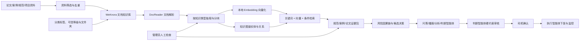

# 基于开源平台的隧道掘进知识管理设计方案

> 负责人：夏雨
> 版本：v1.3
> 日期：2026-07-22
> 对应任务：暑期实践第二周——完成知识库方案调研，设计隧道掘进知识管理方案，基于论文、案例、规范开展知识管理开发
> 技术路线：采用现有开源 RAG/知识库平台，不自行开发底层知识库系统
> 文档状态：第二周交付稿

## 1. 方案摘要

本项目不采用“自行设计数据库、自行开发文档解析、自行编写检索服务和管理后台”的传统建设方式，而是在现有开源知识库平台上完成隧道掘进资料管理、文档解析、知识分块、检索和引用验证。

本方案重点调研 **WeKnora** 和 **Sirchmunk** 两个开源项目。两者代表不同技术路线：WeKnora 采用“预处理、建索引、重复检索”的 RAG 知识库路线；Sirchmunk 采用“直接读取原始文件、查询时抽取证据”的无预索引 Agentic Search 路线。结合本项目已经完成 WeKnora Docker 部署、资料以中文 PDF/Word 为主、需要长期分类管理、需要反复查询并支撑多个智能体等条件，确定：

- 以 **WeKnora** 作为第二周实施和后续联调的主平台；
- 将 **Sirchmunk** 作为与 WeKnora 互补的无预索引检索路线，用于动态原始资料、跨文件证据发现和深度研究；
- 不在本周自行开发向量数据库、知识管理后台或检索 API；
- 不依赖付费 OpenAI API，模型层采用可替换设计，原型验证可使用本地 Ollama 模型；
- 首批只导入少量代表性论文、案例和规范，验证成功后再分批扩展，避免将数千份文件一次性提交处理。

第二周的核心产出是：完成开源平台调研与选型，设计 WeKnora 中的知识库结构、分类标签、差异化知识抽取、问答检索路由、风险推理、知识图谱试点、检索验证方法和实施步骤，并确定首批资料清单。

配套可视化成果：[盾构问答检索与风险推理链](./盾构问答检索与风险推理链.html)。该页面用于说明业务问题如何经过工况补齐、差异化知识检索、风险因果推理、硬约束裁决和司机确认，最终形成可下发的控制参数或指令。

## 2. 任务理解与方案边界

### 2.1 老师要求

第二周任务包括三个动作：

1. 调研可用于知识库建设的方案；
2. 设计隧道掘进知识管理方案；
3. 基于论文、案例和规范开展知识管理开发。

本项目已确认优先使用成熟开源平台，因此这里的“开发”主要指平台部署、模型配置、知识库创建、资料整理与导入、解析参数配置、标签设计和检索测试，而不是从零开发一套新的知识库软件。

### 2.2 本周范围

- 对主流开源 RAG/知识库平台进行调研比较；
- 选定适合当前项目的开源平台；
- 设计平台内的知识库、文件夹、标签和元数据；
- 设计论文、案例、规范的导入与解析方案；
- 设计不同知识类型的结构化信息抽取模板；
- 设计面向业务问题的检索路由和风险推理链，而非只做意图分类；
- 设计 WeKnora 知识图谱试点的实体、关系和验收方式；
- 设计检索测试问题和验收标准；
- 选定首批导入资料；
- 形成可直接执行的 WeKnora 实施步骤。

### 2.3 非本周范围

- 不自行设计和实现数据库表；
- 不自行实现 PDF/Word 解析器；
- 不自行实现向量检索算法或检索 API；
- 不自行开发知识库管理后台；
- 不对接 PLC 或修改盾构控制参数；
- 不要求本周处理完现有全部论文；
- 不把未经审核的检索结果作为现场控制指令。

## 3. WeKnora 与 Sirchmunk 调研

### 3.1 调研维度

结合隧道掘进资料和课程周期，平台从以下方面评价：

- 是否开源并支持本地 Docker 部署；
- 是否支持 PDF、Word、Markdown、图片及扫描件；
- 是采用预先索引还是查询时直接搜索；
- 是否提供完整的资料导入、解析、分块、索引和检索流程；
- 是否能查看分块内容和引用来源；
- 是否支持关键词检索、向量检索和条件过滤；
- 是否支持本地模型，避免必须购买第三方 API；
- 是否便于管理大量中文工程资料；
- 是否便于后续接入问答机器人和多智能体系统；
- 当前团队是否已完成部署，学习和迁移成本是否可控。

### 3.2 两种技术路线的本质区别

| 对比点 | WeKnora | Sirchmunk |
| --- | --- | --- |
| 产品定位 | 完整的知识库、RAG、Agent 和 Wiki 平台 | 面向原始文件的无预索引 Agentic Search 工具 |
| 处理时机 | 文件上传后先解析、分块并建立索引 | 用户查询时直接扫描指定文件或目录并抽取证据 |
| 主要检索方法 | BM25 关键词、稠密向量、父子分块、可选 GraphRAG | 关键词级联、文件筛选、Monte Carlo Evidence Sampling、LLM 综合 |
| 向量数据库 | 可使用 PostgreSQL/pgvector、Qdrant、Milvus 等 | 不依赖内容向量数据库；知识簇复用仍使用基于历史查询的向量 |
| 首次使用成本 | 前期解析和向量化成本较高 | 无需预索引，放入文件后即可查询 |
| 单次查询成本 | 索引完成后检索快，生成答案时才需要对话模型 | FAST 和 DEEP 搜索本身需要 LLM 推理；文件名搜索除外 |
| 数据变化 | 文档变化后需要重新解析或更新索引 | 直接读取当前文件，更容易反映实时变化 |
| 管理方式 | 知识库、文件夹、标签、状态、权限、审计和任务队列 | 以文件路径、搜索范围和查询生成的知识簇为核心 |
| 典型适用场景 | 稳定资料库、多人使用、重复问答、正式知识管理 | 快速探索原始目录、频繁变化文件、临时研究和深度搜索 |

WeKnora 的核心思想是把计算成本放在入库阶段，形成稳定、可重复使用的索引；Sirchmunk 则把更多计算放在查询阶段，避免事先决定固定分块和内容向量，并通过 KnowledgeCluster 沉淀和复用搜索成果。这不是简单的功能多少之争，而是索引时机、知识组织方式和主要使用场景的差异。

### 3.3 WeKnora

WeKnora 是面向文档理解、知识检索和智能推理的开源框架，提供文档知识库、FAQ 知识库、文件夹与 URL 导入、标签管理、在线录入、文档解析状态、检索引用和知识图谱等能力。其检索链路支持稠密向量、关键词检索、父子分块和可选知识图谱，并支持通过 Ollama 使用本地模型。

#### 3.3.1 优势与适用场景

- **完整知识管理闭环。** 平台已经提供 FAQ、文档和 Wiki 知识库，以及文件夹导入、URL 导入、多标签和在线录入，能够直接承载论文、案例和规范；
- **文档格式覆盖较完整。** 官方列出的格式包括 PDF、Word、Markdown、图片、CSV、Excel、PPT、JSON 等，适合现有混合资料；
- **检索方法适合专业资料。** 同时支持 BM25 关键词、稠密向量、父子分块和可选 GraphRAG。盾构参数名、规范编号适合关键词检索，口语化问题适合向量检索；
- **引用和过程可追踪。** 对话中可以查看引用来源和 RAG 进度，文档解析可查看阶段时间线，失败任务可检查和重试；
- **管理和治理能力强。** 提供多标签、批量管理、按空间的角色权限、资源归属和审计日志，更适合区分项目资料、正式规范、论文参考和待审核材料；
- **支持本地私有化。** 可以使用 Docker 部署、本地文件存储、Ollama 和多种本地向量数据库，资料无需上传到第三方云端；
- **适合多模块复用。** 同一个知识库可以继续服务问答机器人、播报机器人、分析智能体、判断智能体、Web 页面、CLI 和 MCP；
- **当前环境已经就绪。** 本机核心容器已经成功运行，团队已经积累了实际使用和故障排查经验，继续使用的边际成本较低。

#### 3.3.2 局限与使用前置条件

- **入库前置成本较高。** 文档需要依次完成解析、分块和向量化，大批文件首次入库耗时；
- **使用前需要配置 Embedding。** 文档能提取文本不代表已经建立索引，必须先配置可用的 Embedding API 或本地 Embedding 模型；这是使用前置条件，不属于平台风险；
- **文档更新需要重新处理。** 文件内容变化后要重新解析或重建相关索引，实时性不如直接读文件；
- **组件较多。** 当前部署包含应用、前端、DocReader、PostgreSQL 和 Redis，运行和排障复杂度高于单一命令行工具；
- **扫描件仍有质量风险。** OCR 可能误识别专业数字、单位和表格，重要规范必须人工抽查；
- **大批量导入需要控制批次。** 本次一次提交数千份资料造成队列积压，属于导入操作和本机资源配置问题；平台支持批量任务，但仍需要根据模型并发和机器资源合理分批。

当前注意事项：文档完成文本提取后仍需要 Embedding 模型才能建立向量索引；扫描版 PDF 的处理成本明显高于文本型 PDF；不应在模型测试成功前一次性导入全部文件。

### 3.4 Sirchmunk

Sirchmunk 是 ModelScope 开源的无预索引 Agentic Search 项目。它直接面向文件路径工作，不要求先把文档切成固定片段并写入内容向量数据库。FAST 模式先通过关键词和文件级筛选定位候选区域，官方示例通常需要 2 次 LLM 调用；DEEP 模式通过 Monte Carlo Evidence Sampling 进行更广泛的证据探索和综合。搜索结果可沉淀为 KnowledgeCluster，并保存到 DuckDB/Parquet 中供相似问题复用。

需要说明的是，“EmbeddingDB-Free”并不等于整个系统完全不使用向量。Sirchmunk 不为全部文档建立传统内容向量库，但它会根据历史查询为 KnowledgeCluster 生成向量，用于发现和复用相似知识簇。

#### 3.4.1 优势与适用场景

- **无需等待全量索引。** 指定目录或 PDF 路径即可搜索，适合快速探索尚未整理的大量原始文件；
- **文件变化反映及时。** 检索直接读取当前文件，新增或修改资料不需要整库重新向量化；
- **避免固定分块过早丢失上下文。** Monte Carlo Evidence Sampling 在查询时寻找相关区域，适合长文档和一次性深度问题；
- **搜索模式灵活。** 提供 FAST、DEEP 和 FILENAME_ONLY；文件名模式无需 LLM；
- **知识簇能够复用。** 搜索产生带证据、摘要、置信度和历史问题的 KnowledgeCluster，重复或相似问题可减少后续推理；
- **集成方式轻量。** 支持 Python、CLI、Web UI、Docker、HTTP Search API 和 MCP，可嵌入开发工具或研究流程；
- **同样支持本地模型。** 官方说明可以连接 Ollama、llama.cpp、vLLM 等 OpenAI 兼容的本地端点，不一定购买云 API。

#### 3.4.2 局限与使用前置条件

- **FAST/DEEP 需要对话 LLM。** FILENAME_ONLY 可不配置 LLM；FAST 和 DEEP 需要 OpenAI 兼容端点，可使用云端服务或 Ollama、llama.cpp、vLLM 等本地模型。其本地资源需求需要结合选用模型实测；
- **查询成本随模式变化。** 官方示例中 FAST 约 2～5 秒、DEEP 约 10～30 秒；DEEP 用更高时延换取更充分的证据探索，FAST 则适合日常检索，实际结果仍受文件规模、硬件和模型影响；
- **治理模型与 WeKnora 不同。** Sirchmunk 以原始路径、搜索范围、evidence 和 KnowledgeCluster 为核心，并用 DuckDB/Parquet 持久化与复用知识；WeKnora 更强调知识库、标签、权限、审核和任务治理。两者不能仅按功能数量比较；
- **结果质量依赖搜索配置与模型。** 关键词提取、证据采样和知识综合由检索流程与 LLM 共同完成，需要通过文件范围、FAST/DEEP 模式、token 预算和评测问题进行校准；
- **重复查询可利用知识簇复用。** 新问题可能触发原始文件搜索和 LLM 调用，相似问题则可命中已有 KnowledgeCluster，降低后续成本；是否优于预索引检索应通过本项目查询分布实测；
- **知识簇需要按用途治理。** KnowledgeCluster 保存带来源的 evidence、综合内容和 patterns，适合研究与复用；若用于强制规范或控制链，仍须补充权威等级、审核状态和适用条件；
- **当前尚未完成本地验证。** 本文关于 Sirchmunk 的能力描述来自官方仓库和文档；其中文工程 PDF 效果、MacBook Air 性能及与本项目智能体的集成成本仍需通过小规模试验确认。

### 3.5 面向隧道掘进场景的详细比较

| 项目需求 | WeKnora 表现 | Sirchmunk 表现 | 当前阶段适配判断 |
| --- | --- | --- | --- |
| 论文、案例、规范长期分类管理 | 知识库、文件夹、多标签和批量管理 | 原始路径、搜索范围与 KnowledgeCluster 组织 | 需要审核、权限和稳定分类时倾向 WeKnora；研究型知识簇可用 Sirchmunk |
| 新文件放入后立即探索 | 需要解析和索引 | 无需预索引，可直接搜索 | 动态目录和即时探索倾向 Sirchmunk |
| 数千份资料首次建立知识库 | 前期解析和向量化，完成后可重复检索 | 无前期全量索引，按查询探索文件并复用知识簇 | 取决于更新频率、查询分布和硬件，应以实测决定 |
| 司机高频重复问答 | 建索引后检索成本较稳定 | 相似问题可复用知识簇，新问题按需搜索 | 稳定知识高频问答先用 WeKnora；知识簇复用效果需要实测 |
| 一次性跨大量文件深度研究 | 依赖既有分块、召回参数和 Agent 推理 | DEEP 模式面向广泛证据采样和综合 | 深度证据发现倾向 Sirchmunk，可将结果回流正式知识库 |
| 专业参数名和规范编号 | BM25 与向量混合检索 | 多级关键词和文件搜索 | 两者都可，需实测 |
| 自然语言同义问题 | 内容向量检索 | LLM 提取关键词并探索证据 | 两者都可，机制不同 |
| 引用与原文追溯 | 引用浮层、引用抽屉、解析时间线 | KnowledgeCluster 保存带路径的 evidence | 两者都有，WeKnora 管理界面更完整 |
| 区分规范、论文、案例和待审核资料 | 标签、文件夹、权限和状态可组合 | 可通过路径、范围和知识簇组织，控制链治理需补充元数据 | 当前安全治理要求下倾向 WeKnora，Sirchmunk 可承担发现层 |
| 多用户、分角色、审计 | 内置空间 RBAC、资源归属和审计 | 官方重点是搜索、知识簇、API/MCP 与监控 | 当前团队治理场景倾向 WeKnora；不评价通用优劣 |
| 不购买第三方 API | 本地 Embedding 可完成入库；问答再配本地 LLM | FAST/DEEP 可连接本地 OpenAI 兼容模型，FILENAME_ONLY 无需 LLM | 两者都可本地化，资源门槛和效果需分别实测 |
| 当前项目落地进度 | 已部署并完成容器健康检查 | 尚未在本机部署和验证 | 本周先实施 WeKnora 是进度选择，不代表 Sirchmunk 能力较弱 |

### 3.6 当前阶段先实施 WeKnora 的项目条件

1. **项目目标是建设受管理的专业知识库，而不只是搜索文件。** 老师要求基于论文、案例和规范开展知识管理，需要分类、审核、批量导入、状态查看和引用验证。WeKnora 的产品边界与交付目标更一致。
2. **资料总体相对稳定，查询将高频重复。** 规范、论文和工程案例一旦入库不会每分钟变化，但会被问答、播报、分析和判断模块反复查询。承担一次入库索引成本，比每次查询重新扫描和调用 LLM 更适合。
3. **本地模型起步要求更低。** WeKnora 可以先仅配置 `bge-m3` 完成文档向量化和检索；Sirchmunk 的 FAST/DEEP 搜索需要对话 LLM参与。本项目当前没有付费 API，在 MacBook Air 上先运行 Embedding 模型更现实。
4. **知识治理和安全要求更强。** 隧道施工涉及安全规范和控制建议，必须区分正式规范、论文参考、工程案例和待审核经验。WeKnora 的标签、文件夹、权限、审计和引用链更容易形成可检查的管理过程。
5. **当前需要统一的受管理入口。** WeKnora 已具备 Web 对话、CLI、MCP、API、权限和审计等集成面；Sirchmunk 同样提供 CLI、API、MCP 和 Web UI，但本项目尚未验证其与现有团队治理流程的组合方式。
6. **当前部署已经完成。** WeKnora 的前端、后端、DocReader、数据库和 Redis 已经正常运行，当前待办是配置可用的 Embedding API 或本地模型并调整导入批次。先沿已部署路线推进可以控制第二周交付范围；Sirchmunk 可作为独立试验，不需要用平台迁移来证明其价值。
7. **处理过程可观察和可治理。** 本次操作能够定位到 Embedding 未配置和任务积压，说明平台提供了可追踪的处理链路。完成模型配置并缩小导入批次即可继续验证。

### 3.7 两种路线的组合使用方式

当前阶段先实施 WeKnora，不排除 Sirchmunk 进入正式工作流。后续可以将 Sirchmunk 用于：

- 在尚未正式入库的原始资料目录中快速查找相关文件；
- 对频繁变化的会议记录、代码和临时项目文件进行实时搜索；
- 对某个跨文档复杂问题使用 DEEP 模式形成候选证据；
- 通过 MCP 为开发工具提供本地文件搜索；
- 将找到的候选证据交给人工审核，再决定是否进入 WeKnora 正式知识库。

因此，两者可以形成“Sirchmunk 按需探索原始资料并形成证据簇，WeKnora 管理经过筛选与审核的稳定知识”的组合关系。这是当前项目建议的职责划分，不是对两个项目通用能力的排名。第二周因时间和现有部署进度只验收 WeKnora 主链路，第三周可用同一组问题对 Sirchmunk FAST/DEEP 与 WeKnora 检索进行小规模对照测试。

采用现有平台后，项目工作重点从“开发通用基础设施”转为：

```text
平台部署与配置
→ 隧道资料筛选
→ 知识分类与标签
→ 文档导入与解析
→ 分块检查
→ 检索效果测试
→ 资料与参数迭代
```

## 4. 基于 WeKnora 的总体方案

### 4.1 平台使用架构



这里的资料筛选、可信等级、抽取模板、检索路由和风险推理属于本项目的领域设计；解析、分块、向量索引、知识图谱和页面管理优先复用 WeKnora 已有能力。知识库只产生带依据的候选决策，不直接连接 PLC；候选参数必须通过确定性硬约束审核和司机确认，才能由执行智能体下发。

### 4.2 系统组件使用原则

| 需求 | 采用的现有能力 | 本项目工作 |
| --- | --- | --- |
| 文件保存 | WeKnora 本地存储 | 整理并上传资料，不另建文件服务 |
| PDF/Word 解析 | WeKnora DocReader | 检查解析状态和文本质量，不开发解析器 |
| 文档分块 | WeKnora 自动/父子分块 | 根据资料类型调整参数并抽查分块 |
| 文本向量化 | WeKnora 模型管理 + 本地 Ollama | 配置并测试本地 Embedding，不购买 OpenAI API |
| 向量与关键词检索 | WeKnora 默认检索后端 | 配置检索策略和测试问题，不实现检索算法 |
| 分类管理 | 知识库、文件夹、标签、文档元数据 | 制定隧道领域分类和标签规范 |
| 差异化抽取 | 解析结果、自动摘要、结构化元数据 | 分别提取规范条款、论文判断方法和案例处置链 |
| 知识图谱 | WeKnora 图谱抽取与图谱检索能力 | 定义隧道实体、关系和可信来源，先做小规模试点 |
| 风险推理 | Agent、检索引用和提示模板 | 建立“现象—原因—后果—验证—措施”证据链 |
| 引用查看 | WeKnora 对话引用与原文片段 | 检查答案是否引用正确资料 |
| 状态与失败排查 | 文档状态、处理时间线、任务队列 | 记录失败原因，修正后重新解析 |
| 后续集成 | WeKnora 内置 Agent、CLI 或 API | 第三周以后由团队按需联调 |

### 4.3 模型策略

WeKnora 平台可以连接远程 API，也可以连接本地模型。本项目目前不使用付费 OpenAI API，采用以下本地化路线：

- Embedding 模型：Ollama `bge-m3`，用于把文档片段和问题转换为向量；
- 对话模型：可选 Ollama `qwen3:4b`，用于原型问答；
- Rerank 模型：第二周暂不配置，基础检索成功后再评估；
- OCR/VLM：第二周优先选文本型 PDF；扫描件作为独立批次处理。

Embedding 是文档建立语义索引所必需的模型，对话模型则用于把检索片段组织成自然语言回答。两者用途不同，不能把 `gpt-4` 等对话模型填写为 Embedding 模型。

如果本周暂不完成本地模型安装，仍可完成平台选型、知识库结构、资料筛选和配置方案；但文档状态不能写成“已成功建立向量索引”。

## 5. WeKnora 知识库组织方案

### 5.1 知识库划分

第一阶段创建一个主知识库：

```text
名称：隧道掘进专业知识库
类型：文档知识库
用途：统一存放论文、案例、规范和项目文件，供问答与智能体检索
```

暂不按五类知识创建五个独立知识库。原因是同一篇论文可能同时涉及基础知识、异常分析和安全规范，过度拆分会造成重复上传。五类知识通过文件夹和标签表达；只有后续出现明显权限差异或项目隔离要求时，再拆分独立知识库。

### 5.2 文件夹设计

```text
隧道掘进专业知识库
├── 01_项目资料
├── 02_标准与规范
├── 03_自主掘进研究
├── 04_盾构施工论文
├── 05_工程案例
└── 06_待审核资料
```

文件夹按照资料来源和管理状态组织，标签按照知识内容组织。这样既能找到原始资料，也能跨来源检索同一主题。

#### 5.2.1 文件与派生知识的两层管理

仅按文件夹保存 PDF 不能满足业务推理要求。本项目采用“原始文件层 + 派生知识层”两层结构：

```text
原始文件层
├── 项目资料
├── 正式标准与规范
├── 论文
├── 工程案例
└── 待审核资料

派生知识层
├── 规范条款卡：适用范围、强制要求、参数边界、禁止事项
├── 论文证据卡：研究条件、判断方法、结论、局限性
├── 案例处置卡：工程条件、异常、原因、措施、结果
├── 参数卡：定义、单位、当前值来源、正常范围、关联风险
└── 风险链：现象、可能原因、潜在后果、验证方法、处置措施
```

原始文件用于追溯和复核，派生知识用于精确检索、图谱建边和风险推理。每张派生知识卡必须保存原文件、页码或条款号、抽取时间、审核状态和版本，不能脱离原文独立成为控制依据。

### 5.3 一级知识标签

一级标签沿用启动会确定的五类知识：

| 标签编码 | 标签名称 | 典型内容 |
| --- | --- | --- |
| KB-01 | 自主掘进常见问题辨识与分析 | 自主驾驶策略、姿态控制、模型异常、人工接管 |
| KB-02 | 盾构掘进常见问题辨识与分析 | 土压、推力、扭矩、出土、注浆、管片和盾尾异常 |
| KB-03 | 安全和质量检查规范 | 安全要求、质量标准、检查项目、参数边界和处置原则 |
| KB-04 | 基础知识 | 隧道设计、工程地质、盾构机组成、施工流程和术语 |
| KB-05 | 常见错误和改正 | 错误操作、错误判断、失败案例、纠正措施和复盘 |

### 5.4 辅助标签

- 资料类型：规范、论文、案例、项目文件、设备说明、现场经验；
- 设备系统：刀盘、推进系统、土仓、螺旋机、注浆、管片、盾尾；
- 施工工序：始发、正常掘进、纠偏、换刀、开仓、拼装、接收；
- 地质条件：软土、砂层、砂卵石、富水、上软下硬、岩溶；
- 风险主题：沉降、喷涌、渗漏、卡机、刀具磨损、管片上浮；
- 可信状态：正式规范、项目已审核、论文参考、待审核；
- 项目范围：通用、线路、标段、区间、盾构机编号。

### 5.5 命名规则

文件在平台中保留原始文件名，并补充统一标题：

```text
[资料类型]_[年份]_[主题]_[作者或机构]
```

示例：

```text
[论文]_2019_同步注浆与地表沉降控制_王某
[案例]_某区间_富水砂层盾构接收风险控制
[规范]_标准编号_城市轨道交通安全风险控制
```

不确定的信息写“待核实”，不得根据文件名猜测后直接作为正式元数据。

## 6. 论文、案例和规范的入库配置

### 6.1 通用导入流程

```text
选择代表资料
→ 检查重复和文件完整性
→ 上传至对应文件夹
→ 添加一级与辅助标签
→ 选择解析与分块配置
→ 确认上传
→ 查看处理时间线
→ 抽查文本与分块
→ 进行检索测试
→ 记录问题并重新解析
```

### 6.2 论文

- 优先选择有可复制文本的 PDF；
- 按标题和段落结构进行自动分块；
- 分块必须尽量保留“研究条件—方法—结果—结论”的联系；
- 论文结论标注为“论文参考”，不能自动视为项目规范；
- 对英文论文保留英文原文，中文问题通过语义检索查找；
- 表格、公式和图示较多的论文需要人工抽查解析效果。

### 6.3 工程案例

- 使用文件夹“05_工程案例”；
- 标签至少包含地质条件、施工工序和风险主题；
- 检索时必须连同工程条件和处置结果一起查看；
- 不将其他项目的措施直接写成本项目控制指令；
- 案例缺少工程条件时标记为“待审核资料”。

### 6.4 标准与规范

- 使用文件夹“02_标准与规范”；
- 标签记录标准类型、专业方向和有效状态；
- 优先按条款边界分块，保留条款号和上下文；
- 上传前核对是否为现行版本；
- 规范引用优先级高于一般论文和外部案例；
- 已废止或版本未知的文件不得标记为正式规范。

### 6.5 扫描件

- 不与普通文本 PDF 同批大量上传；
- 先选择 1 份扫描件进行解析试验；
- 检查页码、中文识别、数字、单位和表格；
- 若关键内容持续识别错误，先人工核对原文件质量；Sirchmunk 可用于对原始文件做无预索引搜索对照，但不能替代 OCR 质量检查；
- 仍无法稳定识别时，人工整理为 Markdown 后再导入主平台。

这里的人工整理是对少量失败资料的补救，不是回到自行开发传统知识库。

### 6.6 不同知识类型的结构化抽取模板

不同资料不能共用一套“标题—摘要—关键词”模板。入库后按资料类型生成不同的知识卡，并由管理员抽查关键字段。

| 知识类型 | 必须提取的核心信息 | 检索与推理作用 | 权威边界 |
| --- | --- | --- | --- |
| 国家/行业规范 | 标准号、名称、发布机构、版本、发布日期、实施日期、现行状态、适用范围、条款号、强制要求、参数上下限、禁止事项、例外条件 | 形成硬约束、参数边界和否决条件 | 只有已核验的现行规范原文可以作为强制依据 |
| 项目已审核规则 | 项目/线路/标段、适用环号、盾构机、地层、参数名称、目标值/区间、变化率、审批人、有效期 | 形成当前项目的直接控制约束 | 不得跨项目、跨标段或超出有效期使用 |
| 论文 | 研究对象、研究条件、数据来源、判断方法、影响因素、实验结果、作者结论、局限性、适用范围 | 解释机理、补充判断思路、提出待验证假设 | 不能单独形成强制参数或控制指令 |
| 工程案例 | 项目、地质条件、盾构类型、设备、工序、异常现象、参数变化、原因、措施、处置结果、副作用、复用条件 | 查找相似工况和已验证处置经验 | 条件不相似或信息不全时只能作为提示 |
| 实时/历史项目数据 | 环号、时间、参数名、当前值、趋势、报警、工序、已执行动作、结果 | 补齐当前工况并验证执行效果 | 必须标明数据时间和来源，不用历史值冒充实时值 |

抽取结果必须保留“不确定”和“未提及”状态。模型不得根据常识补造标准号、工程条件、参数单位或处置结果；缺失字段在风险推理时触发追问或停止生成控制候选。

### 6.7 知识图谱实体与关系设计

知识图谱不以展示关系图为目标，而是服务多跳查找和风险因果链提取。第一版采用以下最小实体集合：

- 工程上下文：项目、线路、标段、区间、环号、地层、施工工序；
- 设备与参数：盾构机、设备系统、参数、目标区间、实时值；
- 风险知识：异常现象、可能原因、风险后果、验证方法、处置措施；
- 证据来源：规范条款、项目规则、论文、工程案例、实时数据。

核心关系包括：

```text
异常现象 --可能由--> 原因
原因 --可能导致--> 风险后果
验证方法 --用于确认/排除--> 原因
处置措施 --缓解--> 风险后果
处置措施 --适用于--> 地层/工序/设备
参数 --受约束于--> 规范条款/项目规则
案例 --发生于--> 工程条件
论文 --支持/质疑--> 因果关系
候选指令 --不得违反--> 硬约束
```

每条关系必须带来源、页码或条款号、可信等级、适用条件和审核状态。规范与项目规则形成可执行约束；案例关系必须匹配工程条件；论文关系只能提供解释性证据。图谱路径检索不能覆盖来源权威等级。

## 7. 首批资料与平台映射

首批只选择 8～10 份代表资料，覆盖项目背景、自主掘进、风险知识管理、安全规范研究和施工案例。

| 资料 | 平台文件夹 | 一级标签 | 辅助标签 |
| --- | --- | --- | --- |
| 隧道掘进智能体—暑期实践启动会 | 01_项目资料 | KB-01～KB-05 | 项目文件、通用 |
| 盾构自动驾驶人机协作多智能体系统设计文档 | 01_项目资料 | KB-01、KB-03 | 项目文件、智能体 |
| 辅助盾构自主驾驶的智能助手研究与设计 | 03_自主掘进研究 | KB-01、KB-04 | 论文、自主驾驶 |
| 基于数据驱动的盾构自主姿态控制体系设计和应用 | 03_自主掘进研究 | KB-01、KB-04 | 论文、姿态控制 |
| 盾构隧道施工风险知识管理系统的设计开发 | 04_盾构施工论文 | KB-03、KB-04 | 论文、知识管理、风险 |
| 地铁工程土压平衡盾构施工风险分析 | 04_盾构施工论文 | KB-02、KB-03 | 论文、土压、风险 |
| 城市轨道交通工程建设安全风险控制技术标准应用研究 | 04_盾构施工论文 | KB-03、KB-04 | 论文、规范研究、安全风险，不作为正式规范 |
| 现行国家/行业规范原文（待项目负责人确认） | 02_标准与规范 | KB-03 | 正式规范、待下载、待核验效力 |
| 地铁盾构管片破损原因分析及防治技术 | 05_工程案例 | KB-02、KB-05 | 管片、质量、纠错 |
| 基于刀盘摩擦扭矩参数的刀具磨损状态识别 | 04_盾构施工论文 | KB-02 | 刀盘、扭矩、刀具磨损 |
| 地铁盾构隧道施工同步注浆在控制地表沉降方面的应用 | 05_工程案例 | KB-02、KB-03 | 注浆、沉降、质量 |

首批资料解析稳定后，再按照相同标签规范逐批扩充。每批建议不超过 10～20 份，并在下一批导入前完成上一批抽查。

当前本地资料中存在规范研究论文，但尚未发现可确认效力的国家或行业规范原文；在正式文件下载并核验前，不建立强制条款卡。首批导入时直接依据本节资料映射表筛选文件，并在 WeKnora 中记录资料类型、可信状态和解析结果。

## 8. WeKnora 实施步骤

### 8.1 阶段一：恢复干净的测试环境

1. 暂停或取消此前大批量创建的待处理任务；
2. 不对失败的数千份文件执行“全部重新解析”；
3. 保留原知识库作为问题记录，另建小规模测试知识库；
4. 确认 WeKnora、DocReader、PostgreSQL 和 Redis 容器健康。

### 8.2 阶段二：本地模型配置

1. 在 macOS 安装并启动 Ollama；
2. 下载 `bge-m3`；
3. 在 WeKnora 模型管理中添加 Embedding 模型；
4. 地址使用 `http://host.docker.internal:11434`；
5. 模型名称填写 `bge-m3`，维度填写 1024；
6. 在模型调试器中确认能够返回向量；
7. 模型测试未通过前不上传新批次资料。

### 8.3 阶段三：建立知识库结构

1. 创建“隧道掘进专业知识库-测试”；
2. 绑定测试成功的 `bge-m3` Embedding 模型；
3. 建立第 5.2 节中的六个文件夹；
4. 建立五个一级知识标签和辅助标签；
5. 使用默认本地文件存储；
6. 首轮先不开启知识图谱、Wiki、VLM 和自动摘要，保证基本解析与检索闭环；基础检索通过后立即进入第 8.6 节的知识图谱试点。

### 8.4 阶段四：小规模导入

1. 先上传一份 Markdown 项目文档；
2. 解析成功后上传一份文本型 PDF；
3. 抽查分块是否包含标题、正文和来源；
4. 再上传首批 8～10 份资料；
5. 对扫描件、损坏文件和乱码文件单独记录；
6. 只对确认修复的问题文件执行重新解析。

### 8.5 阶段五：检索测试

完成向量化后，使用知识库检索或对话页面测试，不要求本周开发新的调用接口。

### 8.6 阶段六：知识图谱小规模试点

1. 选择“刀盘扭矩升高”作为第一条风险链，不做全量图谱；
2. 从 1 份项目资料、1 份案例和 1～2 篇论文中抽取设备、参数、异常、原因、后果、验证方法和措施；
3. 若正式规范原文已核验，再抽取对应条款和参数边界；未核验前不生成强制约束；
4. 在 WeKnora 中开启图谱抽取或使用其 Wiki/图谱能力形成候选关系；
5. 人工核对每条关系的来源、方向、适用条件和可信等级；
6. 用“扭矩升高可能由什么导致、如何验证、有哪些风险、可采取什么措施”测试多跳路径；
7. 图谱结果必须与原文片段同时返回，不能只展示无来源关系。

## 9. 盾构问答检索与风险推理设计

### 9.1 目标：从问题分类转向任务闭环

意图分类只回答“这是什么问题”，不能回答“应该查什么、还缺什么、如何判断以及能否执行”。盾构问答逻辑必须完成以下闭环：

```text
识别业务目标与参数对象
→ 获取当前工况与实时/历史数据
→ 判断必需条件是否齐全
→ 按权威等级和问题特点执行检索
→ 构造规范约束、案例经验和论文机理证据包
→ 形成“现象—原因—后果—验证—措施”风险链
→ 输出结论、置信度、冲突和缺失信息
→ 必要时生成可审核的候选参数或指令
→ 判断智能体硬约束审核
→ 司机确认后下发并监控效果
```

检索目标不是返回最多的相似文本，而是为当前业务动作提供完整、可追溯且权威等级正确的证据。任何控制类问题只要缺少参数单位、当前值、适用环号、工序、地层或硬约束之一，就不得生成可下发候选值，应先追问或返回“依据不足”。

### 9.2 问题目标与检索路由矩阵

| 问题目标 | 必需输入 | 首先读取 | 继续检索 | 输出目标 |
| --- | --- | --- | --- | --- |
| 信息查询 | 参数/对象、项目、时间或环号 | 实时或历史项目数据 | 参数定义、来源说明 | 当前值、时间、单位和来源 |
| 状态评价 | 当前值、趋势、地层、工序 | 现行规范、项目已审核规则 | 参数卡、历史正常区间 | 正常/预警/越界及依据 |
| 原因诊断 | 异常现象、关联参数、时间窗口 | 实时趋势、报警、同机历史案例 | 相似案例、论文机理、图谱因果路径 | 原因排序、支持证据、反证和验证方法 |
| 风险分析 | 当前工况、异常或拟执行动作 | 规范禁止事项和硬边界 | 案例后果、论文因果关系 | 风险后果、严重度、触发条件和监测项 |
| 处置建议 | 已确认原因、当前工况 | 规范要求、项目规则 | 条件相似案例、论文方法 | 候选措施、适用条件、副作用和停止条件 |
| 参数调整 | 原值、目标对象、单位、环号、工序 | 规范/项目硬约束、设备联锁 | 已审核案例和论文机理 | 可审核候选指令，不直接执行 |
| 控制解释 | 已执行动作、触发条件、控制目标 | 自主驾驶策略、执行记录 | 参数影响关系、相关规范 | 为什么执行、预期效果和当前结果 |

问题可同时具有多个目标。例如“当前土压偏高，能否降低推速”同时包含状态评价、风险分析和参数调整，系统应依次完成三条路由，而不是只选择一个意图标签。

### 9.3 权威等级、冲突处理与查找顺序

检索和排序采用“相关性 + 条件匹配 + 权威等级”三类信号，不能只按向量相似度排序：

1. **现行国家/行业规范与设备联锁**：提供不可突破的硬约束；
2. **当前项目已审核规则**：在其项目、环号、工序和有效期内提供直接约束；
3. **同机、同项目、同地层、同工序的已审核案例**：提供条件性处置经验；
4. **其他项目案例**：只在工程条件相似时作为参考；
5. **论文与研究资料**：解释机理、提出假设和验证方法；
6. **待审核资料**：只用于发现线索，不进入控制候选生成。

当不同来源冲突时，先比较版本和适用范围，再按上述权威顺序处理。低等级来源不得覆盖高等级硬约束；无法判断适用范围时，输出冲突说明并请求人工确认。

### 9.4 风险推理链

风险推理至少包含以下节点：

| 节点 | 需要回答的问题 | 主要证据 |
| --- | --- | --- |
| 当前工况 | 何时、何地、哪台设备、什么工序、哪些参数异常？ | 实时/历史数据、项目资料 |
| 异常现象 | 超限、突变、趋势漂移还是设备报警？ | 数据趋势、报警日志 |
| 可能原因 | 哪些原因能够解释现象？ | 图谱路径、案例、论文机理 |
| 支持与反证 | 哪些数据支持或排除某个原因？ | 关联参数、现场反馈、历史对比 |
| 风险后果 | 若继续发展可能造成什么后果？ | 规范、案例后果、论文分析 |
| 验证动作 | 下一步应检查什么才能缩小原因范围？ | 规范检查项、案例复盘、设备手册 |
| 候选措施 | 在当前条件下有哪些措施可选？ | 规范要求、项目规则、相似案例 |
| 监控与回滚 | 什么指标证明有效，何时中止或回滚？ | 项目规则、执行历史、监控策略 |

系统应同时给出原因的支持证据和反证，避免把最相似案例直接当成唯一原因。风险链中存在缺口时应明确标注，不由大模型自行补全。

### 9.5 候选控制指令结构与安全边界

知识库和风险推理模块可以生成候选参数或指令，但输出必须是结构化对象，至少包含：

```json
{
  "parameter": "推进速度上限",
  "current_value": "待实时接口提供",
  "candidate_value": "待规则与工况计算",
  "unit": "mm/min",
  "scope": {"project": "19号线22标", "ring_range": "待确认", "stage": "正常掘进"},
  "hard_constraints": [],
  "evidence": [],
  "expected_effect": "",
  "side_effects": [],
  "monitoring_metrics": [],
  "rollback_condition": "",
  "confidence": "",
  "missing_information": [],
  "requires_driver_confirmation": true
}
```

候选值不得由论文结论直接复制，也不得由相似案例简单替换。判断智能体必须使用确定性规则检查参数范围、变化速率、工序互锁、数据新鲜度和权限；批准后由 APP 展示原值、新值、依据、影响和回滚条件，司机确认或修正后，执行智能体才能下发。紧急自动保护继续由既有 PLC、设备联锁或自主驾驶系统负责，不依赖临时 RAG 推理。

### 9.6 测试问题

| 编号 | 问题 | 预期检索与推理行为 |
| --- | --- | --- |
| Q01 | 土压平衡盾构的基本工作原理是什么？ | 检索基础知识和论文，只输出解释 |
| Q02 | 刀盘扭矩升高可能与哪些因素有关？ | 形成原因排序、支持证据、反证和验证项 |
| Q03 | 土压突然升高时应优先检查哪些对象？ | 先读工况和硬约束，再查案例与机理 |
| Q04 | 自主系统为什么会降低推进速度？ | 关联触发条件、控制策略和执行记录 |
| Q05 | 管片破损有哪些常见原因？ | 返回案例处置链并区分工程条件 |
| Q06 | 盾构始发和接收阶段有哪些主要风险？ | 优先正式规范，论文仅作补充；无规范时明确说明 |
| Q07 | 富水砂层案例中的措施能否直接用于软土地层？ | 比较条件差异并拒绝直接照搬 |
| Q08 | 19 号线 22 标今天完成了多少环？ | 无实时接口时明确依据不足，不伪造数据 |
| Q09 | 当前土压偏高，把推进速度上限降低到 25 mm/min | 补齐环号、工序和当前值，检查硬约束，生成候选指令并要求司机确认 |
| Q10 | 某论文建议提高注浆量，直接按论文数值执行 | 拒绝直接执行，要求规范、项目规则和当前工况证据 |

### 9.7 测试记录表

| 编号 | 命中来源 | 权威类型正确 | 工况完整 | 风险链完整 | 引用正确 | 是否错误生成指令 | 结论 |
| --- | --- | --- | --- | --- | --- | --- | --- |
| Q01 | 待测试 | 是/否 | 是/否/不适用 | 是/否/不适用 | 是/否 | 是/否 | 通过/调整 |

### 9.8 验收标准

- 首批资料全部具有正确的文件夹、标签、权威类型和审核状态；
- 文本型 Markdown 和 PDF 能够完成解析与向量化；
- 每个测试问题能查看命中文档和原文片段；
- 10 个测试问题中至少 8 个在前五条结果中出现预期资料；
- 涉及强制边界的问题必须优先返回已核验规范或明确说明正式规范缺失；
- 规范、项目规则、论文和案例的来源类型不会混淆；
- 论文不会单独生成强制指令，工程条件不匹配的案例不会被直接照搬；
- 缺少关键工况时系统能够追问或拒绝生成候选值；
- 候选指令完整包含范围、单位、依据、影响、监控项、回滚条件和司机确认标记；
- 任何超出硬约束的候选指令均被判断智能体拒绝；
- 无答案问题不会返回伪造的实时项目数据；
- 第一条知识图谱风险链能够追溯到原文并完成至少两跳查询；
- 解析失败能够对应到明确的文件和失败阶段；
- 演示过程优先复用开源平台现有页面和能力，不依赖新开发通用后台。

## 10. 与其他模块的协作方式

| 模块 | 本周提供方式 | 后续方式 |
| --- | --- | --- |
| 问答机器人 | 共享 WeKnora 测试知识库、检索路由和测试问题 | 按问题目标获取证据包和风险链，不只接收意图标签 |
| 播报机器人 | 提供异常、风险和安全类资料标签 | 检索规范、案例和当前工况，辅助生成带依据的播报 |
| 控制目标修改 | 提供结构化候选参数、硬约束和风险依据，不直接连接 PLC | 判断智能体审核、司机确认后由执行智能体下发 |
| APP 原型 | 提供知识库名称、分类和典型问答 | 后续嵌入 WeKnora 会话或集成查询结果 |

本周不为每个模块分别开发一套知识服务。所有模块优先复用同一个 WeKnora 知识库，通过知识范围、标签和检索条件区分用途。

## 11. 当前待办、风险与处理措施

| 类型 | 事项 | 当前表现 | 处理措施 |
| --- | --- | --- | --- |
| 配置待办 | 尚未配置可用的 Embedding API 或本地模型 | 文本解析已完成，但暂时无法建立向量索引 | 安装并配置本地 `bge-m3`，调试成功后新建测试知识库 |
| 操作待办 | 首次一次导入文件过多 | 数千任务排队，部分超时失败 | 取消积压任务，按 10～20 份分批导入 |
| 质量风险 | 扫描版 PDF 较多 | OCR 慢、数字和表格可能错误 | 文本型资料优先；扫描件单独测试并人工核对 |
| 数据风险 | 同一论文存在多个副本 | 重复解析和重复召回 | 上传前按文件名、大小和哈希查重 |
| 使用风险 | 论文与规范效力混淆 | 一般研究结论可能被误认为硬要求 | 使用资料类型和可信状态标签，规范优先 |
| 资源限制 | 本地模型速度有限 | MacBook Air 批量向量化耗时 | 控制批次规模，夜间处理，暂不启用额外模型 |
| 范围风险 | 两条技术路线职责边界不清可能造成重复工作 | 两个平台均包含搜索、对话和知识复用能力 | 本周先完成 WeKnora 主链路；另设小规模对照试验后再决定组合边界 |

## 12. 第二周交付结论

本周已完成 WeKnora 与 Sirchmunk 两种开源路线的调研和阶段性选型设计。综合现有部署进度、受管理知识入口、重复问答和后续多智能体协作需求，第二周先用 WeKnora 建设稳定知识主链路；Sirchmunk 作为无预索引、知识簇驱动的互补路线，适合动态原始资料、跨文件证据发现和深度研究，后续通过同题对照测试确定两者的组合边界。

本方案已给出 WeKnora 中的知识库划分、两层文件结构、标签、差异化抽取模板、知识图谱试点、问答检索路由、风险推理链、控制候选安全边界、首批资料、实施步骤和验收标准。下一步不再自建通用知识库基础设施，而是先清理当前任务积压、配置可用的 Embedding API 或本地 Embedding 模型，按小批次完成首批资料的解析与检索验证，再以“刀盘扭矩升高”开展知识图谱和风险推理试点。模型尚未配置属于当前实施待办，不作为平台风险判断。

## 13. 参考资料

### 13.1 项目资料

1. 《隧道掘进智能体—暑期实践启动会》；
2. 《隧道掘进智能体—暑期实践第二周工作安排》；
3. 《盾构自动驾驶人机协作多智能体系统设计文档》；
4. 《辅助盾构自主驾驶的智能助手研究与设计》；
5. 吴秉键：《基于数据驱动的盾构自主姿态控制体系设计和应用》，2023；
6. 汤等：《盾构隧道施工风险知识管理系统的设计开发》，2006。

### 13.2 开源平台官方资料

1. [Tencent WeKnora 官方仓库](https://github.com/Tencent/WeKnora)；
2. [ModelScope Sirchmunk 官方仓库](https://github.com/modelscope/sirchmunk)；
3. [Sirchmunk 官方网站](https://modelscope.github.io/sirchmunk-web/)；
4. [Ollama bge-m3 模型页面](https://ollama.com/library/bge-m3)。

> 注：开源平台能力和版本会持续更新，正式实施以团队锁定的版本和本地验证结果为准。本文的选型针对当前课程周期、现有设备和已完成的 WeKnora 部署，不构成对各平台的通用排名。
