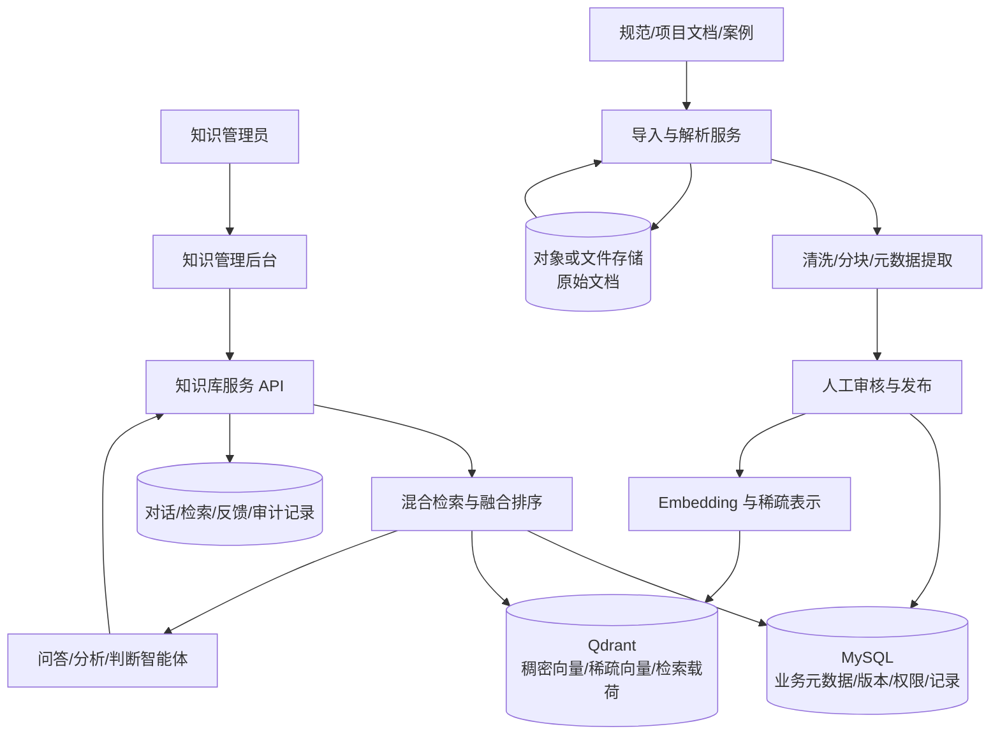

# 隧道施工知识库管理和查询——第一周设计成果

> 负责人：夏雨  
> 版本：v0.1  
> 日期：2026-07-14  
> 状态：第一周设计完成，待业务评审

## 1. 文档目的

本文档是知识库模块第一周的可检查成果，集中说明需求分析、知识库总体架构和向量数据库选型。设计依据为项目启动会材料和人机协作多智能体系统设计，目标是在进入开发前明确模块边界、核心数据、处理流程、接口方向和技术底座。

本周“完成”指方案已形成并具备评审条件，不表示生产系统已经开发或部署。业务资料、真实数据规模和部署资源仍需项目负责人确认。

## 2. 需求分析

### 2.1 建设目标

知识库模块负责把隧道设计、盾构设备、施工规范、常见问题和现场经验转化为可维护、可检索、可追溯的知识服务，为问答智能体、分析智能体、判断智能体、学习智能体和管理后台提供统一数据基础。

首期建设目标如下：

1. 建立统一的五类知识分类体系；
2. 支持文档录入、解析、分块、审核、发布、更新和停用；
3. 同时支持专业术语精确检索和自然语言语义检索；
4. 检索结果携带原文片段、来源、版本和适用范围；
5. 提供稳定的知识检索 API，支持上层智能体并行开发；
6. 保存对话、检索、反馈和操作记录，为知识优化与审计提供依据。

### 2.2 用户与使用场景

| 用户或调用方 | 典型场景 | 主要诉求 |
| --- | --- | --- |
| 盾构司机 | 查询异常现象、施工规范和处置经验 | 答案易懂、响应及时、依据可查看 |
| 项目管理人员 | 查询项目知识、风险和历史案例 | 可按项目、知识类型和时间筛选 |
| 知识库管理员 | 导入、编辑、审核、发布和停用知识 | 操作可追踪，更新不破坏历史引用 |
| 问答智能体 | 根据用户问题检索证据 | 接口稳定，召回结果相关且可引用 |
| 分析智能体 | 验证异常现象并查找处置依据 | 支持工况、设备、地质等条件过滤 |
| 判断智能体 | 审核控制建议和人工指令 | 优先返回有效规范、硬约束和已审核案例 |
| 学习智能体 | 沉淀接管、驳回及纠错案例 | 新知识进入正式库前必须经过审核 |

### 2.3 知识范围

首期知识按照启动会确定的五个一级分类组织：

| 编码 | 一级分类 | 典型内容 |
| --- | --- | --- |
| KB-01 | 自主掘进常见问题辨识与分析 | 模型异常、目标偏差、策略解释、人工接管原因 |
| KB-02 | 盾构掘进常见问题辨识与分析 | 土压波动、姿态偏差、刀盘扭矩异常、出土异常 |
| KB-03 | 安全和质量检查规范 | 参数边界、工序互锁、检查项目、风险处置要求 |
| KB-04 | 基础知识 | 隧道设计、地质、盾构机系统、施工工艺与术语 |
| KB-05 | 常见错误和改正 | 错误操作、错误判断、纠正措施和复盘案例 |

二级分类不在代码中写死，由管理员维护。每条知识至少绑定一个一级分类，并可增加设备系统、施工工序、地质类型、风险等级和适用项目等标签。

### 2.4 功能需求

| 编号 | 功能需求 | 优先级 | 验收标准 | 状态 |
| --- | --- | --- | --- | --- |
| FR-01 | 知识分类管理 | P0 | 能新增、调整、停用二级分类；已被引用的分类不可直接物理删除 | 已设计 |
| FR-02 | 文档导入与解析 | P0 | 支持首期约定格式导入，保存原文件、解析状态和失败原因 | 已设计，格式待确认 |
| FR-03 | 知识编辑与版本管理 | P0 | 能编辑标题、正文、来源、适用范围和标签；发布后修改产生新版本 | 已设计 |
| FR-04 | 审核与发布 | P0 | 草稿只有通过审核后才能被正式检索；驳回必须填写原因 | 已设计，角色待确认 |
| FR-05 | 知识停用 | P0 | 停用后不进入普通检索，但历史记录仍可按知识版本追溯 | 已设计 |
| FR-06 | 混合检索 | P0 | 同一请求可执行语义和关键词召回，通过融合排序返回 Top K | 已设计 |
| FR-07 | 条件过滤 | P0 | 可按项目、分类、状态、设备、工序、风险等级和有效期过滤 | 已设计 |
| FR-08 | 检索 API | P0 | 返回知识与分块标识、得分、原文片段、标题、来源和版本 | 已设计 |
| FR-09 | 对话与检索记录 | P1 | 可追踪一次回答使用了哪些检索条件和知识片段 | 已设计 |
| FR-10 | 用户与角色管理 | P1 | 至少区分浏览者、知识编辑者、审核者和管理员 | 已设计 |
| FR-11 | 反馈管理 | P1 | 用户可标记有用、无用或内容错误，管理员可查看处理状态 | 已设计 |
| FR-12 | 审计日志 | P1 | 新增、编辑、审核、发布、停用和恢复操作均记录操作者及时间 | 已设计 |

### 2.5 非功能需求

| 编号 | 要求 | 第一阶段目标 |
| --- | --- | --- |
| NFR-01 | 可追溯性 | 所有正式检索结果均可定位到文档、知识版本和原文分块 |
| NFR-02 | 安全性 | 未审核、已停用或越权项目知识不得进入普通检索结果 |
| NFR-03 | 一致性 | 结构化记录更新失败时不得留下可被检索的孤立向量 |
| NFR-04 | 可维护性 | 分类、标签、分块策略和检索参数可配置，不写死在业务代码中 |
| NFR-05 | 检索效果 | 初始评测集上 Recall@5 不低于 85%，错误知识进入 Top 5 的比例为 0 |
| NFR-06 | 性能 | 在第一阶段数据规模下，单次 Top 10 检索 P95 小于 1 秒，不含大模型生成时间 |
| NFR-07 | 可部署性 | 支持在项目内网以容器方式独立部署，不依赖公有云托管服务 |

### 2.6 模块边界

知识库模块负责知识内容、元数据、向量索引、检索、审核和追溯；不负责直接生成最终自然语言答案，不直接读取或控制 PLC，也不审核控制指令是否可执行。最终回答由问答或中枢智能体生成，控制安全由判断智能体负责，实时工况由已有管控平台提供。

## 3. 知识库架构设计

### 3.1 总体架构



### 3.2 分层职责

| 层次 | 组件 | 职责 |
| --- | --- | --- |
| 接入层 | 管理后台、检索 API | 提供知识维护、审核、查询和系统调用入口 |
| 应用层 | 知识服务、审核服务、检索服务 | 执行业务校验、权限控制、版本流转和结果组装 |
| 处理层 | 解析、清洗、分块、向量化 | 将原始文档转为可检索知识片段，记录处理状态 |
| 检索层 | 稠密召回、稀疏召回、RRF 融合、过滤 | 兼顾语义相似、专业词精确匹配和业务条件 |
| 数据层 | MySQL、Qdrant、文件存储 | 分别保存业务真值、检索索引和原始文件 |
| 治理层 | 权限、审核、版本、日志、评测 | 防止错误和过期知识进入高风险使用链路 |

### 3.3 核心数据对象

| 对象 | 关键字段 | 说明 |
| --- | --- | --- |
| `knowledge_category` | id、parent_id、code、name、status | 支持两级及后续扩展分类 |
| `source_document` | id、file_name、file_hash、source_type、uri、parse_status | 保存文档来源及防重复导入信息 |
| `knowledge_item` | id、category_id、title、status、current_version_id、risk_level | 一条可独立维护的知识主题 |
| `knowledge_version` | id、knowledge_id、version、content、source_ref、scope、valid_from、valid_to | 保存发布内容、来源、适用范围和有效期 |
| `knowledge_chunk` | id、version_id、chunk_no、content、token_count、qdrant_point_id | 连接结构化版本与向量点位 |
| `knowledge_tag` | id、type、name | 设备、工序、地质、项目等标签 |
| `knowledge_tag_rel` | knowledge_id、tag_id | 知识与标签多对多关系 |
| `review_record` | id、version_id、reviewer_id、decision、comment、created_at | 审核结论与理由 |
| `user` / `role` | id、name、status；角色与权限关系 | 用户和最小角色权限控制 |
| `conversation` / `message` | id、user_id、project_id；role、content、created_at | 保存对话上下文 |
| `retrieval_log` | id、message_id、query、filters、result_chunk_ids、latency_ms | 支持检索复盘和效果评测 |
| `feedback` | id、message_id、type、comment、status | 收集有用性和错误反馈 |
| `audit_log` | id、operator_id、action、object_type、object_id、detail、created_at | 记录关键管理操作 |

MySQL 是知识状态和版本的业务真值来源；Qdrant 只保存检索所需向量、片段文本及最小过滤载荷。两侧通过不可变的 `knowledge_chunk.id` 关联。MySQL 数据库和数据表统一使用 `utf8mb4` 字符集与 `utf8mb4_unicode_ci` 排序规则，以完整保存中文、英文、数字、单位和特殊符号。

MySQL 主键建议使用应用层生成的 UUID，并以 `BINARY(16)` 保存，API 层再转换为标准 UUID 字符串，避免随机 `CHAR(36)` 主键导致索引体积和页分裂增加。状态、类型等稳定枚举使用 `VARCHAR` 并由应用层校验，避免数据库 `ENUM` 给后续变更带来迁移成本。可变筛选条件可使用 `JSON` 保存，但项目、分类、状态、设备、工序和风险等级等高频过滤字段仍应设计为普通列或关系表并建立索引，不依赖 JSON 全表扫描。

### 3.4 知识生命周期

```text
导入 → 解析 → 清洗分块 → 编辑补充元数据 → 待审核
     → 审核通过 → 向量化与索引 → 发布 → 可检索
     → 内容变更 → 新版本审核发布 → 旧版本保留追溯
     → 停用/过期 → 普通检索排除，但历史引用仍可查看
```

MySQL 事务不能与 Qdrant 组成同一个本地事务，因此两者采用最终一致性而不是假设原子提交。发布动作先在一个 MySQL 事务中写入知识版本、分块和索引任务，并将版本标记为 `indexing`；后台任务随后写入 Qdrant，成功后在 MySQL 中改为 `published`，失败则记录 `index_failed`、失败原因和重试次数。对外检索只接受 MySQL 状态为 `published` 且 Qdrant payload 状态一致的片段。任务使用唯一业务键保证幂等，并由定时补偿任务扫描超时的 `indexing` 和 `index_failed` 记录。删除默认采用软删除，先从普通检索中排除，再异步清理 Qdrant，历史版本和审计记录继续保留。

MySQL 索引设计遵循最左前缀原则，针对实际查询建立组合索引，例如知识列表可使用 `(status, category_id, updated_at)`，版本查询可使用 `(knowledge_id, version)` 唯一索引，对话查询可使用 `(user_id, created_at)`。长正文使用 `LONGTEXT` 保存，不在 MySQL 中保存向量。MySQL `FULLTEXT` 仅作为后台标题或原文管理查询的可选补充；面向智能体的关键词与语义混合召回仍统一由 Qdrant 的稀疏、稠密向量完成，避免维护两套主检索排序逻辑。

### 3.5 文档分块和元数据策略

- 优先按标题层级、条款、表格和案例边界进行语义分块，不直接按固定字符粗暴切断；
- 单个分块初始控制在约 300～600 中文字，保留 50～100 字重叠，后续用评测集调整；
- 每个分块保留文档标题、章节路径、页码或条款号、知识版本和来源链接；
- 规范条款、参数限制和安全规则不得跨条款混合分块；
- 表格需转为带表头的文本表示，避免数值脱离字段和单位；
- PDF 扫描件需要 OCR，低置信度片段必须人工校验后才能发布。

### 3.6 混合检索流程

1. 接收查询文本、项目、知识分类、设备、工序、风险等级等过滤条件；
2. 进行术语标准化和同义词扩展，例如将现场简称链接到标准设备或参数名；
3. 生成稠密向量，用于自然语言语义召回；
4. 生成稀疏表示，用于专业术语、编号、参数名和精确词召回；
5. 在 Qdrant 中分别召回候选，先应用 `status=published`、项目权限和有效期过滤；
6. 使用 RRF 融合两路排序，必要时增加规则加权或重排模型；
7. 去重并按知识版本聚合，返回 Top K 原文证据；
8. 写入检索日志，为 Recall@K、命中率和人工反馈分析提供数据。

高风险查询优先返回规范和已审核规则，不以普通经验案例覆盖强制性约束。若没有足够相关的证据，接口返回低置信度标志，由上层智能体提示无法确认，而不是编造答案。

### 3.7 检索 API 草案

```http
POST /api/v1/knowledge/search
Content-Type: application/json
```

```json
{
  "query": "土压突然升高应该检查什么？",
  "top_k": 5,
  "project_id": "project-001",
  "filters": {
    "category_codes": ["KB-02", "KB-03"],
    "equipment": ["土压系统"],
    "risk_levels": ["high", "medium"]
  },
  "retrieval_mode": "hybrid"
}
```

```json
{
  "request_id": "req-001",
  "took_ms": 82,
  "low_confidence": false,
  "items": [
    {
      "knowledge_id": "kn-101",
      "version": 3,
      "chunk_id": "chunk-101-02",
      "title": "土压异常波动检查要点",
      "content": "……原文片段……",
      "score": 0.87,
      "category_code": "KB-02",
      "source": "某盾构施工规范第4.2节",
      "scope": "土压平衡盾构",
      "effective_at": "2026-07-14"
    }
  ]
}
```

API 首期还应提供知识列表、知识详情、创建草稿、提交审核、审核、发布、停用和恢复接口。所有写接口需要鉴权并记录审计日志。

## 4. 向量数据库选型

### 4.1 选型约束

当前项目处于五周暑期实践的第一阶段，数据规模尚未确认，优先考虑以下因素：

1. 能同时满足稠密语义检索和稀疏关键词检索；
2. 支持分类、项目、状态、设备、风险等级等元数据过滤；
3. 可在内网本地部署，部署和维护成本适合学生团队；
4. Python 接入清晰，便于封装独立检索 API；
5. 后续可扩展，不因原型简便而完全牺牲生产化能力。

### 4.2 候选方案比较

评分采用 1～5 分，5 分最佳；这是基于当前项目约束的工程判断，不代表产品的通用排名。

| 维度 | 权重 | Qdrant | Milvus | Chroma |
| --- | ---: | ---: | ---: | ---: |
| 混合检索能力 | 25% | 5 | 5 | 3 |
| 元数据过滤 | 20% | 5 | 5 | 4 |
| 本地部署与运维难度 | 20% | 5 | 3 | 5 |
| Python/API 易用性 | 15% | 5 | 4 | 5 |
| 大规模扩展能力 | 10% | 4 | 5 | 3 |
| 当前项目匹配度 | 10% | 5 | 3 | 4 |
| 加权结果 | 100% | **4.9** | **4.25** | **4.0** |

说明：

- Qdrant 官方文档明确提供稠密与稀疏查询组合、RRF/DBSF 融合、多阶段 Query API，以及基于 payload 的组合过滤；同时支持开源自托管和多种部署方式，能较好平衡功能与运维成本。
- Milvus 支持多向量混合搜索、RRF/加权重排和从 Lite、Standalone 到 Distributed 的多层部署形式，扩展能力强；但在当前未知规模、短周期和小团队条件下，优先采用其分布式能力会增加部署与运维复杂度。
- Chroma 的 collection 模型和 Python 使用方式简洁，支持元数据与文档内容过滤，适合快速原型；但本项目明确要求专业词与语义混合召回及后续工程化，因此不作为首选底座。

### 4.3 选型结论

第一阶段选择 **Qdrant** 作为向量数据库，MySQL 保存业务元数据、权限、版本、索引任务、对话与审计记录，原始文件使用仓库外的文件或对象存储保存。MySQL 与 Qdrant 职责分离：MySQL 决定知识是否有效以及用户是否有权访问，Qdrant 负责候选片段召回与排序；服务层必须结合 MySQL 权限和状态校验后再返回检索结果。

建议以 Docker 单节点方式搭建开发环境，先创建一个知识分块 collection，在单点中配置稠密向量、稀疏向量和必要 payload 索引。`project_id`、`category_code`、`status`、`equipment`、`process`、`risk_level`、`valid_from`、`valid_to` 等常用过滤字段需要建立 payload index。

### 4.4 选型边界与迁移条件

出现以下任一情况时重新评估 Milvus 或其他分布式方案：

- 向量规模增长到单节点无法满足容量或延迟目标；
- 明确要求跨节点高可用、资源隔离或复杂的集群治理；
- 实际压测表明 Qdrant 在目标并发和过滤条件下无法达到性能指标；
- 平台已有统一 Milvus 集群及成熟运维体系，复用成本明显低于新建 Qdrant。

为降低迁移成本，业务层不直接暴露数据库客户端，统一通过 `VectorStore` 接口封装 `upsert_chunks`、`delete_by_version`、`hybrid_search` 和 `health_check` 等能力。

### 4.5 官方参考资料

- [Qdrant：Hybrid and Multi-Stage Queries](https://qdrant.tech/documentation/search/hybrid-queries/)
- [Qdrant：Filtering](https://qdrant.tech/documentation/search/filtering/)
- [Qdrant：Overview and Deployment Models](https://qdrant.tech/documentation/overview/)
- [Milvus：Deployment Options](https://milvus.io/docs/install-overview.md)
- [Milvus：Hybrid Search](https://milvus.io/docs/v2.4.x/multi-vector-search.md)
- [Chroma：Architecture Overview](https://docs.trychroma.com/docs/overview/architecture)
- [Chroma：Metadata Filtering](https://docs.trychroma.com/docs/querying-collections/metadata-filtering)

## 5. 第一周验收结论

| 第一周任务 | 验收证据 | 结论 |
| --- | --- | --- |
| 需求分析 | 本文第 2 节：目标、用户、范围、12 条功能需求、7 条非功能需求及边界 | 已完成，待业务评审 |
| 知识库架构设计 | 本文第 3 节：总体架构、数据对象、生命周期、分块、检索流程和 API 草案 | 已完成，待接口评审 |
| 向量数据库选型 | 本文第 4 节：约束、候选评分、Qdrant 结论及迁移条件 | 已完成 |

## 6. 待确认事项与下一步

### 待确认事项

1. 首批知识文档的来源、文件格式、数量和使用授权；
2. 哪些角色拥有知识审核和发布权限；
3. 生产环境操作系统、容器支持、CPU、内存和磁盘限制；
4. 问答模块需要的最终请求与响应字段；
5. 安全规范、普通知识和经验案例之间的优先级规则；
6. 第一阶段是否需要实现用户画像，若需要，其明确业务用途是什么。

### 第二周暂定交付

- 搭建 MySQL 与 Qdrant 开发环境；
- 将核心数据对象细化为数据库表和迁移脚本；
- 使用少量样例文档完成导入、分块、向量化和混合检索闭环；
- 与问答模块确认 `/api/v1/knowledge/search` 契约；
- 建立不少于 30 条典型问题的初始检索评测集；
- 形成知识管理后台静态原型。
