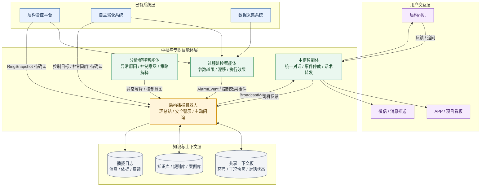
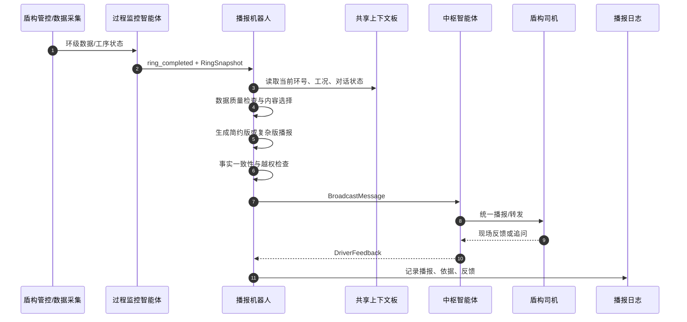
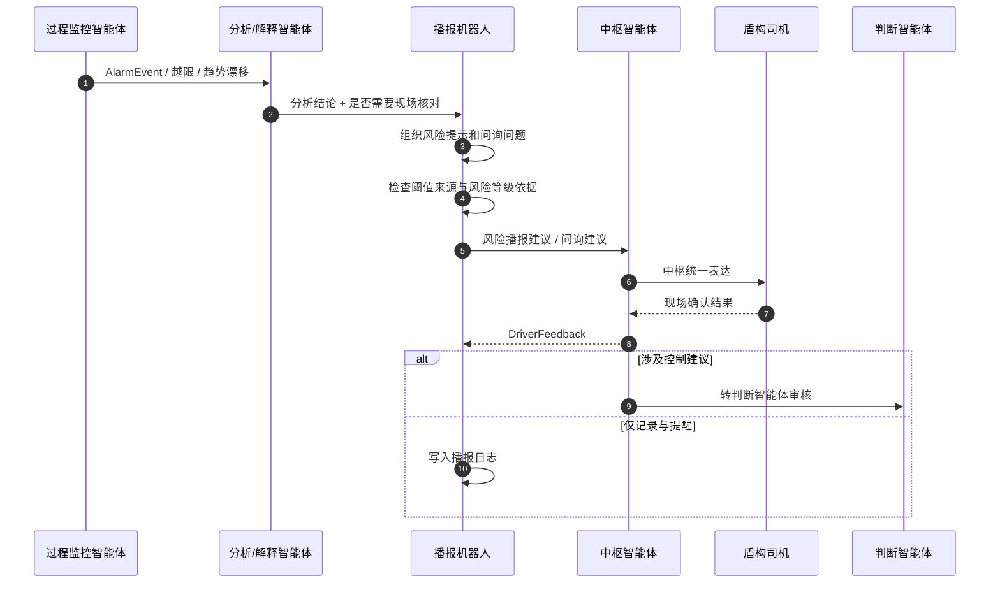
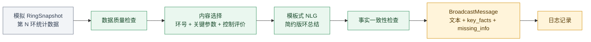

# 盾构播报机器人 - 需求分析和架构设计

> 项目：隧道掘进智能体  
> 模块：盾构播报机器人 / 掘进实时播报智能体  
> 负责人：王英杰  
> 文档用途：作为第一周周报的辅助成果，汇总需求分析、数据接口规范、架构设计、NLG 方案和一致性检查内容。  

## 1. 模块概述

盾构播报机器人是在已有盾构自主驾驶系统之上叠加的智能化服务模块，目标是让系统在每环掘进完成后，能够主动向司机或相关人员说明本环掘进状态、控制效果、风险情况和需要现场补充确认的信息。

本模块对应“会播报”和“会预警”的能力，是“让盾构机会说话”的高频入口。它不直接控制盾构设备，不下发参数，不替代判断智能体进行安全裁决；它更适合作为专职智能体，输出结构化播报建议、风险提示和问询内容，再由中枢智能体统一组织对司机表达。

## 2. 需求分析

### 2.1 目标用户与场景

| 用户 | 典型场景 | 当前痛点 | 播报机器人价值 |
| --- | --- | --- | --- |
| 盾构司机 | 每环掘进完成后查看本环状态 | 需要主动查看多个参数，不一定理解自主驾驶动作意图 | 自动总结关键工况和控制效果，降低理解成本 |
| 盾构司机 | 系统出现异常趋势或报警 | 异常依赖人工发现，响应可能滞后 | 主动提醒风险，提示是否需要现场核对 |
| 现场技术人员 | 了解近期掘进状态和异常记录 | 信息分散在平台、日志和人工沟通中 | 提供可追溯环总结、风险摘要和现场反馈 |
| 项目管理人员 | 掌握施工态势或整理周报素材 | 人工整理耗时，格式不统一 | 为管理端摘要和报告自动化提供基础信息 |
| 远程支持人员 | 判断现场问题是否需要介入 | 现场描述可能不完整 | 记录关键参数、报警事件和司机反馈，便于复盘 |

### 2.2 核心业务场景

| 场景编号 | 场景 | 触发方式 | 需求重点 | 状态 |
| --- | --- | --- | --- | --- |
| S-01 | 每环完成自动播报 | 环完成事件触发 | 总结工况、目标值、实际值、控制评价 | 已确认 |
| S-02 | 控制效果评价 | 环完成或司机质疑时触发 | 判断目标与实际偏差，说明控制是否稳定 | 已确认 |
| S-03 | 自主驾驶动作解释 | 司机不理解或播报需要说明时触发 | 解释降速、调压、纠偏等动作意图 | 假设 |
| S-04 | 安全警示 | 参数越限、漂移、模型报警或异常事件触发 | 给出风险等级和核对建议 | 已确认 |
| S-05 | 现场主动问询 | 系统无法直接判断现场情况时触发 | 询问异响、渗漏、出土异常、特殊操作等 | 已确认 |
| S-06 | 简约/复杂播报模式 | 按工况、角色或风险等级选择 | 正常工况简洁，异常工况详细 | 已确认 |
| S-07 | 管理端摘要 | 班组交接、日报/周报整理时触发 | 汇总关键环、异常和处置状态 | 假设 |
| S-08 | 与问答机器人衔接 | 播报后司机追问时触发 | 将“为什么”类问题转入问答/解释流程 | 假设 |

### 2.3 核心用户需求

| 编号 | 用户需求 | 使用场景 | 验收标准 | 优先级 | 状态 |
| --- | --- | --- | --- | --- | --- |
| UR-01 | 每环完成后自动生成本环掘进情况总结 | 每环完成后 | 生成包含环号、关键参数、控制评价的环总结文本 | P0 | 已确认 |
| UR-02 | 说明目标值与实际值偏差 | 环总结、控制效果复盘 | 说明偏差方向、偏差程度和是否需要关注 | P0 | 已确认 |
| UR-03 | 异常或风险出现时主动提醒 | 参数越限、趋势漂移、模型报警 | 标明风险等级、涉及对象和建议核对事项 | P0 | 已确认 |
| UR-04 | 解释自主驾驶调整动作 | 降速、调压、纠偏等动作后 | 生成“结论 + 数据依据 + 控制意图”的说明 | P1 | 假设 |
| UR-05 | 无法直接判断现场情况时主动询问 | 异响、渗漏、出土异常、特殊操作 | 提出不超过 1-2 个明确问题，并记录反馈 | P0 | 已确认 |
| UR-06 | 播报机器人不直接下发控制指令 | 涉及控制建议或参数调整时 | 只输出提示、解释、问询或建议，控制动作转入判断/执行链 | P0 | 已确认 |

## 3. 数据接口规范

当前真实盾构管控平台接口、样例环数据和历史掘进数据尚未提供，因此本规范只定义后续对接所需的数据类别和假设接口，不声称真实平台已具备这些字段。

### 3.1 数据类别

| 数据类别 | 主要内容 | 用途 | 来源状态 |
| --- | --- | --- | --- |
| 环信息 | 环号、里程、开始/结束时间、工序状态 | 判断播报触发点，关联记录 | 待确认 |
| 掘进参数 | 推进速度、总推力、刀盘扭矩、刀盘转速、土压/土仓压力、螺旋机转速 | 环总结和控制效果评价 | 待确认 |
| 注浆参数 | 注浆压力、注浆量、同步注浆状态 | 判断注浆是否正常，支撑风险提示 | 待确认 |
| 姿态参数 | 切口/盾尾水平偏差、高程偏差、姿态变化量 | 支撑姿态控制评价和纠偏解释 | 待确认 |
| 控制目标 | 推进速度目标、土压目标、姿态目标、注浆目标、约束区间 | 对比目标值与实际值 | 待确认 |
| 控制动作 | 自主系统调整速度、压力、姿态、注浆等动作记录 | 解释自主驾驶意图 | 待确认 |
| 报警事件 | 模型报警、设备报警、通讯异常、参数越限、趋势漂移 | 触发安全警示或现场核对 | 待确认 |
| 司机反馈 | 现场异常、特殊操作、核对结果、人工接管原因 | 补充模型无法感知的信息 | 假设 |

### 3.2 输入接口

#### `RingSnapshot`

用于每环完成后的环总结播报。

| 字段 | 类型 | 示例 | 用途 | 状态 |
| --- | --- | --- | --- | --- |
| `ring_id` | string/int | `125` | 环号索引 | 待确认 |
| `chainage` | number/string | `K12+340.5` | 里程位置 | 待确认 |
| `start_time` / `end_time` | datetime | `2026-07-15T10:00:00` | 统计本环时间范围 | 待确认 |
| `advance_speed_avg` | number | `38 mm/min` | 播报推进速度 | 待确认 |
| `total_thrust_avg` | number | `12500 kN` | 播报推力状态 | 待确认 |
| `cutterhead_torque_avg` | number | `2800 kN*m` | 播报刀盘负载 | 待确认 |
| `cutterhead_rpm_avg` | number | `1.2 rpm` | 判断切削状态 | 待确认 |
| `chamber_pressure_avg` | number | `0.18 MPa` | 判断掌子面/土仓压力 | 待确认 |
| `screw_conveyor_speed_avg` | number | `8 rpm` | 判断排土和压力控制状态 | 待确认 |
| `grout_pressure_avg` | number | `0.35 MPa` | 判断注浆压力 | 待确认 |
| `grout_volume_total` | number | `6.5 m3` | 判断注浆量 | 待确认 |
| `tail_horizontal_deviation` | number | `-12 mm` | 判断水平姿态偏差 | 待确认 |
| `tail_vertical_deviation` | number | `8 mm` | 判断高程姿态偏差 | 待确认 |
| `target_values` | object | `{advance_speed: 40}` | 目标/实际对比 | 待确认 |
| `control_actions` | array | `降速、调压` | 解释自主驾驶动作 | 待确认 |
| `data_quality` | object | `{missing: [], delayed: false}` | 判断播报可信度 | 假设 |

#### `AlarmEvent`

用于安全警示和异常核对。

| 字段 | 类型 | 示例 | 用途 | 状态 |
| --- | --- | --- | --- | --- |
| `event_id` | string | `ALM-20260715-001` | 事件索引 | 假设 |
| `ring_id` | string/int | `125` | 关联环号 | 待确认 |
| `event_type` | enum | `参数越限/模型报警/通讯异常/趋势漂移` | 事件分类 | 待确认 |
| `level` | enum | `提示/关注/预警/严重` | 风险等级 | 待确认 |
| `parameter` | string | `土仓压力` | 涉及对象 | 待确认 |
| `actual_value` | number | `0.27 MPa` | 当前值 | 待确认 |
| `threshold` | number/range | `[0.18, 0.25] MPa` | 阈值依据 | 待确认 |
| `trend` | string | `连续上升` | 趋势描述 | 假设 |
| `analysis_summary` | string | `需现场核对` | 分析结论 | 假设 |
| `need_driver_confirm` | boolean | `true` | 是否主动问询 | 假设 |

#### `DriverFeedback`

用于记录系统无法直接感知的信息。

| 字段 | 类型 | 示例 | 用途 | 状态 |
| --- | --- | --- | --- | --- |
| `feedback_id` | string | `FB-001` | 反馈索引 | 假设 |
| `ring_id` | string/int | `125` | 关联环号 | 假设 |
| `question` | string | `现场是否有异常出土？` | 系统问询内容 | 假设 |
| `answer` | string | `无异常` | 司机反馈 | 假设 |
| `operator` | string | `司机A` | 操作人 | 待确认 |
| `time` | datetime | `2026-07-15T10:25:00` | 记录时间 | 假设 |
| `follow_up_required` | boolean | `false` | 是否需升级 | 假设 |

### 3.3 输出接口 `BroadcastMessage`

| 字段 | 类型 | 示例 | 用途 |
| --- | --- | --- | --- |
| `message_id` | string | `BR-125-001` | 播报索引 |
| `ring_id` | string/int | `125` | 关联环号 |
| `mode` | enum | `brief/detail` | 简约版或复杂版 |
| `scene` | enum | `环总结/安全警示/控制解释/现场问询` | 播报场景 |
| `risk_level` | enum | `正常/关注/预警/严重/待确认` | 风险等级 |
| `summary` | string | `本环控制效果良好` | 一句话结论 |
| `key_facts` | array | `推进速度、总推力、刀盘扭矩` | 数据依据 |
| `nlg_text` | string | `本环推进速度...` | 播报文本 |
| `questions` | array | `请确认现场是否有异常情况需要记录` | 主动问询 |
| `missing_info` | array | `安全阈值来源待确认` | 缺失信息 |
| `provenance` | array | `RingSnapshot, AlarmEvent` | 数据来源 |

## 4. 架构设计

### 4.1 系统位置



### 4.2 内部处理流程

```mermaid
flowchart LR
    classDef input fill:#E8F1FF,stroke:#3B6EA8,color:#1D3557
    classDef process fill:#EAF7EF,stroke:#2F8F5B,color:#174A2A
    classDef nlg fill:#FFF4DA,stroke:#D18B00,color:#553700
    classDef check fill:#FFECEC,stroke:#D64545,color:#7A1F1F
    classDef output fill:#F6EAFE,stroke:#8A4FC4,color:#3D1B63

    A["输入适配<br/>RingSnapshot / AlarmEvent / DriverFeedback"] --> B["数据质量检查<br/>缺失 / 延迟 / 单位 / 时间戳"]
    B --> C["场景与触发判断<br/>环完成 / 报警 / 趋势 / 问询"]
    C --> D["内容选择<br/>关键参数 / 偏差 / 风险 / 待确认项"]
    D --> E["播报模式选择<br/>brief / detail"]
    E --> F["NLG 生成<br/>模板 / 规则 / 表达层"]
    F --> G["事实一致性检查<br/>字段回溯 / 幻觉检查 / 越权检查"]
    G --> H["结构化输出<br/>BroadcastMessage"]
    H --> I["日志与反馈记录<br/>provenance / missing_info / driver_feedback"]

    class A input
    class B,C,D process
    class E,F nlg
    class G check
    class H,I output
```



### 4.3 每环总结播报流程



### 4.4 安全警示与主动问询流程



## 5. NLG 播报生成方案

播报文本生成不采用无约束自由生成，而采用“结构化数据约束 + 模板/规则 + 表达层 + 事实一致性检查”的混合方案。第一版原型优先使用模板和规则保证准确性、稳定性和可追溯性，复杂解释再考虑引入 LLM 或 RAG。

| 播报模式 | 适用场景 | 文本结构 |
| --- | --- | --- |
| 简约版 | 正常工况、高频环播报、低打扰场景 | 结论 + 环号 + 3-5 个关键参数 + 控制评价 |
| 复杂版 | 异常工况、控制解释、管理端复盘 | 结论 + 数据依据 + 偏差/风险 + 控制意图 + 现场问询 |

### 5.1 简约版模板

```text
第 {ring_id} 环完成。本环推进速度 {advance_speed}，总推力 {total_thrust}，
刀盘扭矩 {torque}，主要参数处于 {status}。控制效果：{control_eval}。
```

### 5.2 复杂版模板

```text
第 {ring_id} 环完成，当前结论为 {summary}。
关键依据：推进速度 {advance_speed}，总推力 {total_thrust}，刀盘扭矩 {torque}，
土仓压力 {pressure}，姿态偏差 {attitude_deviation}。
与目标相比，{deviation_description}。
系统采取 {control_action} 的主要目的为 {control_intent}。
风险提示：{risk_text}。
请确认：{question}
```

### 5.3 事实一致性检查

| 检查项 | 检查方式 |
| --- | --- |
| 准确性 | 播报中的每个数值是否都能回到输入字段 |
| 完整性 | 环总结是否包含环号、关键参数、控制评价 |
| 可读性 | 司机是否能在 10 秒内理解当前是否正常 |
| 专业性 | 术语、单位、参数名是否符合盾构场景 |
| 安全性 | 是否存在越权控制、强制处置、无依据定级 |
| 防幻觉 | 是否出现输入中没有的地质、设备、现场结论 |
| 可追溯 | 是否保留字段来源、事件编号、环号和时间 |

## 6. 一致性检查结果

| 检查项 | 结果 |
| --- | --- |
| 环总结播报是否有需求、接口和架构支撑 | 通过 |
| 控制效果评价是否有目标值、实际值和偏差字段支撑 | 通过，控制目标日志待确认 |
| 安全警示是否有异常事件和风险字段支撑 | 通过，阈值来源待确认 |
| 主动问询是否有司机反馈结构支撑 | 通过 |
| 播报机器人是否存在越权控制设计 | 未发现 |
| 是否把假设接口写成真实接口 | 未发现 |
| 是否把安全阈值写成已确定 | 未发现 |
| 是否能支撑周报中的“需求、接口与架构一致性” | 通过 |

## 7. 后续原型路线

第 2 周可先用模拟数据实现以下最小链路：



完成标准：

| 项目 | 完成标准 |
| --- | --- |
| 输入 | 能读取一条模拟 `RingSnapshot` |
| 内容选择 | 能选出环号、推进速度、总推力、刀盘扭矩、土仓压力、姿态偏差等关键字段 |
| 生成 | 能输出简约版环总结文本 |
| 检查 | 文本中的数值均能回溯到输入字段 |
| 日志 | 能记录播报文本、字段依据、缺失信息 |


## 参考资料

1. ITA-AITES. EPBS土压平衡盾构机. https://tunnel.ita-aites.org/zh/how-to-go-undergound/construction-methods/mechanized-tunnelling/epbs-shield
2. 海瑞克. 土压平衡式盾构机. https://www.herrenknecht.com.cn/produkte/productdetail/%E5%9C%9F%E5%8E%8B%E5%B9%B3%E8%A1%A1%E5%BC%8F%E7%9B%BE%E6%9E%84%E6%9C%BA/
3. 施虎, 龚国芳, 杨华勇, 等. 盾构掘进土压平衡控制模型[J]. 煤炭学报, 2008, 33(3): 343-346. DOI: 10.3321/j.issn:0253-9993.2008.03.024.
4. 吴秉键, 吴惠明, 胡珉, 等. 基于数据驱动的盾构自主姿态控制体系设计和应用[J]. 隧道建设(中英文), 2023, 43(3): 478-485. DOI: 10.3973/j.issn.2096-4498.2023.03.012
5. 赵剑, 吴秉键, 胡珉, 等. “智驭号”自主驾驶系统土层适应性和掘进性能分析[J]. 隧道建设(中英文), 2025, 45(S1): 236-248. DOI: 10.3973/j.issn.2096-4498.2025.S1.024
6. 王舰, 孙宇清. 可控文本生成技术研究综述[J]. 中文信息学报, 2024, 38(10): 1-23. https://jcip.cipsc.org.cn/article/id/zwxxxb_3797
7. 刘泽垣, 王鹏江, 宋晓斌, 等. 大语言模型的幻觉问题研究综述[J]. 软件学报, 2025, 36(3): 1152-1185. DOI: 10.13328/j.cnki.jos.007242
