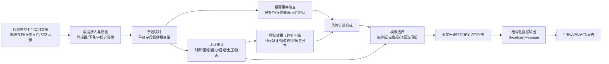

# 盾构播报机器人-设计方案

> 项目：隧道掘进智能体  
> 模块：盾构播报机器人 / 掘进实时播报智能体  
> 负责人：王英杰  
> 周次：第二周  

## 1. 方案概述

盾构播报机器人面向盾构司机、现场技术人员和项目管理人员，目标是在已有盾构自主驾驶系统和盾构管控平台基础上，提供“每环完成后主动总结、出现关注项时主动提示、数据不足时主动问询”的智能服务能力。真实应用中，播报机器人应对接盾构管控平台实时产生的掘进数据、报警事件、控制目标和自主驾驶状态，按环号或事件触发生成播报。

第二周开发阶段暂以 19 号线 22 标历史掘进数据作为样例数据库，用于验证字段读取、环级统计、模板生成和安全警示链路。该 SQL 数据只承担开发与测试作用，不代表真实上线后的数据接入方式。真实上线后，数据来源应切换为盾构管控平台提供的实时数据接口、数据库视图、消息队列或项目统一数据服务。

## 2. 使用需求与安全边界

### 2.1 核心使用需求

本节从使用者角度描述对播报机器人的需求。

| 编号 | 使用者 | 用户需求 | 使用场景 | 验收标准 | 优先级 |
| --- | --- | --- | --- | --- | --- |
| UR-01 | 盾构司机 | 希望每环完成后快速知道本环掘进是否正常 | 环完成后、班组交接前 | 系统能自动播报环号、时间、里程、推进速度、推力、扭矩、土压、姿态等关键结论 | P0 |
| UR-02 | 盾构司机 | 希望异常或风险趋势能被及时提醒 | 姿态偏差、土压波动、刀盘负载异常、报警事件出现时 | 播报明确风险对象、风险等级、依据和现场核对事项 | P0 |
| UR-03 | 现场技术人员 | 希望播报结果能追溯到真实数据，便于核对和复盘 | 查看某环记录或处理异常后 | 播报中的关键数字、风险来源和报警状态可回溯到平台实时数据或规则依据 | P0 |
| UR-04 | 项目管理人员 | 希望快速了解每环施工状态和需要关注的问题 | 管理端查看、日报/周报素材整理 | 系统能生成适合管理复盘的完整播报或结构化摘要 | P1 |
| UR-05 | 远程支持人员 | 希望系统在数据不足或现场不可感知时主动问询 | 系统无法判断出土、渗漏、异响、管片拼装等现场情况时 | 播报提出明确核对问题，并为司机反馈留出记录入口 | P1 |
| UR-06 | 中枢或 APP 展示端 | 希望播报结果是结构化的，便于转发、展示和归档 | 多智能体联动、APP 展示、日志归档 | 输出可包含环总结、风险等级、关键事实、文本话术、数据来源和待确认信息 | P1 |

### 2.2 真实运行安全边界

本节描述播报机器人在真实运行中需要控制的安全边界。

| 边界 | 控制要求 |
| --- | --- |
| 数据边界 | 播报只使用盾构管控平台实时数据、报警事件、控制目标、经确认的规则库和人工反馈；数据缺失或时间戳不一致时不得生成确定结论 |
| 控制边界 | 播报机器人不直接修改控制目标、不下发设备指令、不绕过自主驾驶系统和安全闸门 |
| 安全裁决边界 | 风险等级只作为提示和分流依据，最终安全裁决、停机处置和参数调整应由现场人员、判断智能体或既有安全流程确认 |
| 话术边界 | 播报应表达“发现、提示、核对、建议关注”，避免使用“立即调整”“必须执行某控制动作”等越权命令 |
| 优先级边界 | 严重报警、非常停止、关键设备异常应优先播报；普通环总结在高优先级安全事件出现时应延后或降级 |
| 人工确认边界 | 对出土状态、管片拼装、异响、渗漏等平台无法直接判断的信息，应主动问询现场，不得自行推断 |
| 追溯边界 | 每条安全相关播报应保留数据来源、字段、规则版本和生成时间，便于事后复核 |

## 3. 数据来源与字段设计

### 3.1 开发测试样例数据

第二周开发测试阶段使用 19 号线 22 标历史掘进数据作为样例数据库，主要用于验证字段映射和播报生成效果。

| 样例数据 | 用途 | 当前情况 |
| --- | --- | --- |
| `mb_data_his_auto` | 历史掘进数据样例，支撑环总结和连续参数安全警示测试 | 13,890 行，476 列，读取环号 1028-1047 |
| `config_target_manage` | 控制目标结构参考 | 22 行，39 列，环号范围 23-226（暂不能与 1028-1047 直接关联） |

### 3.2 真实应用数据来源

真实应用中，播报机器人应以盾构管控平台实时数据为主输入，典型数据来源包括：

| 数据来源 | 内容 | 用途 |
| --- | --- | --- |
| 实时掘进数据 | 环号、时间、里程、推进速度、总推力、刀盘扭矩、土仓压力、姿态偏差等 | 生成环总结、工况说明和连续参数风险判断 |
| 控制目标数据 | 速度目标、推力目标、扭矩目标、姿态目标、土压目标等 | 生成目标值与实际值对比、控制效果评价 |
| 报警事件数据 | 土压异常、刀盘扭矩注意、非常停止、注浆异常等 | 触发安全警示和风险等级提升 |
| 自主驾驶状态 | 控制模式、模型选择、控制动作、策略调整原因 | 解释自主驾驶动作和系统意图 |
| 司机反馈 | 现场核对结果、异常补充、人工确认记录 | 补充平台无法直接感知的现场信息 |

### 3.3 最小字段集

| 类别 | 字段 | 用途 |
| --- | --- | --- |
| 环号与时间 | `AVBA10`、`localtime1` | 环索引、起止时间、持续时间 |
| 里程与行程 | `AVBA02`、`ATBA02` | 里程范围、推进净行程 |
| 推进与智控设定 | `ATBS01`、`AZVS01` | 推进速度设定、智控推进泵流量设定 |
| 负载参数 | `ATBA03`、`ACBA03` | 总推力、刀盘扭矩 |
| 土压参数 | `ABBA02`、`ABBA04` | 右侧/左侧土仓土压 |
| 姿态偏差 | `AVSA01`、`AVSA02`、`AVSA11`、`AVSA12` | 前端/后端水平与垂直偏差 |
| 报警位 | `T00029`、`T00030`、`T00031`、`T00037`、`T00038`、`T00054`、`T00067`、`T00110`、`T00142` | 安全警示触发源 |

## 4. 播报链路设计



输出结构包含：

| 字段 | 含义 |
| --- | --- |
| `scene` | 播报场景，例如“环总结 + 安全警示” |
| `summary` | 环级统计结果 |
| `risk` | 风险等级、触发依据、报警事件状态 |
| `messages` | 简约版、完整版、详细说明版播报文本 |
| `questions` | 需要现场核对的问题 |
| `missing_info` | 缺失字段、未确认规则或无法判断的信息 |
| `data_source` | 数据来源、字段来源、规则版本和生成时间 |

## 5. 阈值与风险等级

真实应用中，风险阈值应优先来自盾构管控平台既有报警规则、管理者经验、项目规范文件或经确认的历史统计规则。
第二周开发测试阶段暂采用 `1028-1047` 共 20 环历史数据的统计结果作为演示规则：

```text
关注阈值 = 本批 20 环均值 + 2 × 标准差
严重阈值 = 本批 20 环均值 + 3 × 标准差
```

**该阈值和风险等级规则只用于开发测试，不替代最终工程安全阈值。**

| 风险等级 | 生成条件 | 话术原则 |
| --- | --- | --- |
| 正常 | 未触发报警事件，连续参数未超过关注阈值 | 简要说明未发现明显异常信号 |
| 关注 | 连续参数超过关注阈值，或注意类报警事件触发 | 提示核对风险对象，不给控制指令 |
| 警示 | 异常报警事件触发，或多个参数同时异常 | 明确风险依据，建议转人工或判断智能体 |
| 严重 | 非常停止或严重报警事件触发 | 强调立即关注现场处置流程，不替代安全裁决 |
| 待确认 | 字段缺失、单位不明、规则来源未确认 | 明确数据不足，避免误判 |

## 6. 播报模板

本节以19 号线 22 标历史掘进数据中第1028环为例。

### 6.1 简约版

**适用场景**：盾构司机高频接收，每环完成后快速掌握工况和安全状态。

**输入数据项**

| 数据项 | 字段或变量 |
| --- | --- |
| 环号 | `AVBA10` / `{ring_no}` |
| 持续时间 | `localtime1` 起止差 / `{duration_min}` |
| 推进速度设定均值 | `ATBS01` / `{avg_speed_set}` |
| 平均总推力 | `ATBA03` / `{avg_thrust}` |
| 平均刀盘扭矩 | `ACBA03` / `{avg_torque}` |
| 风险等级 | `{risk_level}` |
| 风险依据 | `{risk_reason}` |

**生成话术**

```text
第 {ring_no} 环已完成，本环持续 {duration_min} 分钟，推进速度设定均值 {avg_speed_set}，平均总推力 {avg_thrust}，平均刀盘扭矩 {avg_torque}。
安全状态：{risk_level}，{risk_reason}；请现场核对{confirm_items}是否存在异常。
```

**开发测试播报结果示例**

```text
第 1028 环已完成，本环持续 26.5 分钟，推进速度设定均值 22.1，平均总推力 11257.8，平均刀盘扭矩 1980.4。
安全状态：关注，前端垂直偏差最大绝对值 25 高于关注阈值 21.0，后端垂直偏差最大绝对值 37 高于关注阈值 35.2；请现场核对姿态偏差、管片拼装和司机感知是否存在异常。
```

### 6.2 完整版

**适用场景**：APP 展示、每环复盘、班组交接，需要同时看到关键参数、姿态范围和风险依据。

**输入数据项**

| 数据项 | 字段或变量 |
| --- | --- |
| 环号、时间、记录数 | `{ring_no}`、`{start_time}`、`{end_time}`、`{record_count}` |
| 里程与行程 | `{mileage_start}`、`{mileage_end}`、`{stroke_max}` |
| 推进与智控设定 | `{avg_speed_set}`、`{avg_smart_pump_set}` |
| 推力和扭矩 | `{avg_thrust}`、`{max_thrust}`、`{avg_torque}`、`{max_torque}` |
| 土仓土压 | `{avg_earth_p_l}`、`{avg_earth_p_r}` |
| 姿态偏差 | `{h_front_range}`、`{v_front_range}`、`{h_tail_range}`、`{v_tail_range}` |
| 风险说明 | `{risk_level}`、`{risk_reason}`、`{threshold_source}` |

**生成话术**

```text
第 {ring_no} 环掘进完成，统计时间为 {start_time} 至 {end_time}，共 {record_count} 条记录，里程由 {mileage_start} 推进至 {mileage_end}，推进净行程最大值为 {stroke_max}。本环推进速度设定均值为 {avg_speed_set}，智控推进泵流量设定均值为 {avg_smart_pump_set}；平均总推力 {avg_thrust}，最大总推力 {max_thrust}，平均刀盘扭矩 {avg_torque}，最大刀盘扭矩 {max_torque}，左右土仓平均土压分别为 {avg_earth_p_l} 和 {avg_earth_p_r}。姿态方面，前端水平偏差 {h_front_range}，前端垂直偏差 {v_front_range}，后端水平偏差 {h_tail_range}，后端垂直偏差 {v_tail_range}。
安全状态判定为 {risk_level}：{risk_reason}。当前报警位字段未触发，风险判定依据为 {threshold_source}。
请现场核对{confirm_items}是否存在异常。
```

**开发测试播报结果示例**

```text
第 1028 环掘进完成，统计时间为 2026-07-18 11:50:03 至 2026-07-18 12:16:35，共 678 条记录，里程由 6773.569 推进至 6774.780，推进净行程最大值为 1226。本环推进速度设定均值为 22.1，智控推进泵流量设定均值为 21.0；平均总推力 11257.8，最大总推力 13235，平均刀盘扭矩 1980.4，最大刀盘扭矩 2410，左右土仓平均土压分别为 3.73 和 3.44。姿态方面，前端水平偏差 -6 至 1，前端垂直偏差 17 至 25，后端水平偏差 -18 至 -12，后端垂直偏差 29 至 37。
安全状态判定为关注：前端垂直偏差最大绝对值 25 高于关注阈值 21.0，后端垂直偏差最大绝对值 37 高于关注阈值 35.2。当前报警位字段未触发，风险判定依据为本批 1028-1047 共 20 环历史数据统计演示规则，正式阈值仍需确认。
请现场核对姿态偏差、管片拼装和司机感知是否存在异常。
```

### 6.3 详细说明版

**适用场景**：管理端复盘、设计评审、算法说明，需要说明数据依据和安全边界。

**输入数据项**

| 数据项 | 字段或变量 |
| --- | --- |
| 环总结全量关键指标 | 完整版全部输入数据项 |
| 报警位状态 | `T00029`、`T00030`、`T00031`、`T00037`、`T00038`、`T00054`、`T00067`、`T00110`、`T00142` |
| 阈值依据 | `{threshold_source}` |
| 关注项 | `{attention_items}` |
| 现场问询 | `{confirm_question}` |

**生成话术**

```text
【环总结】第 {ring_no} 环在 {start_time} 至 {end_time} 完成，里程范围 {mileage_start}-{mileage_end}，推进净行程最大值 {stroke_max}，关键参数为：推进速度设定均值 {avg_speed_set}，平均总推力 {avg_thrust}，最大总推力 {max_thrust}，平均刀盘扭矩 {avg_torque}，最大刀盘扭矩 {max_torque}，左右土仓平均土压 {avg_earth_p_l}/{avg_earth_p_r}，姿态偏差范围为 {posture_summary}。

【安全警示】当前真实报警位未触发；根据 {threshold_source}，本环 {attention_items}，风险等级为 {risk_level}。该风险等级仅用于开发测试展示，不替代现场安全裁决。

【现场问询】{confirm_question}
```

**开发测试播报结果示例**

```text
【环总结】第 1028 环在 2026-07-18 11:50:03 至 2026-07-18 12:16:35 完成，里程范围 6773.569-6774.780，推进净行程最大值 1226，关键参数为：推进速度设定均值 22.1，平均总推力 11257.8，最大总推力 13235，平均刀盘扭矩 1980.4，最大刀盘扭矩 2410，左右土仓平均土压 3.73/3.44，姿态偏差范围为前端水平 -6 至 1、前端垂直 17 至 25、后端水平 -18 至 -12、后端垂直 29 至 37。

【安全警示】当前真实报警位未触发；根据本批 1028-1047 共 20 环历史数据统计演示规则，正式阈值仍需确认，本环前端垂直偏差最大绝对值 25 高于关注阈值 21.0，后端垂直偏差最大绝对值 37 高于关注阈值 35.2，风险等级为关注。该风险等级仅用于开发测试展示，不替代现场安全裁决。

【现场问询】请现场核对姿态偏差、管片拼装和司机感知是否存在异常。如无异常，可记录为“已核对，无异常”。
```

### 6.4 安全警示示例
1028 环开发测试样例的风险等级判定为“关注”，主要依据：

| 指标 | 本环数值 | 关注阈值 | 判定 |
| --- | ---: | ---: | --- |
| 前端垂直偏差最大绝对值 | 25 | 21.0 | 高于关注阈值 |
| 后端垂直偏差最大绝对值 | 37 | 35.2 | 高于关注阈值 |

## 7. 后续对接与限制

后续工作重点是把当前样例数据验证过的播报逻辑迁移到真实盾构管控平台。主要工作和可能限制如下：

| 后续工作 | 需要解决的问题 |
| --- | --- |
| 接入实时数据接口 | 确认平台提供 REST API、数据库视图、消息队列还是其他方式；统一字段名、单位、采样频率和时间戳 |
| 建立环完成触发机制 | 明确环完成事件来自平台状态、推进净行程、环号变化还是工序事件，避免重复播报或漏播 |
| 接入控制目标数据 | 解决控制目标表与历史环号范围不匹配问题，确认真实平台中的目标值版本和环号映射 |
| 接入报警事件 | 明确报警位字段含义、触发值、报警等级、持续时间和恢复状态 |
| 替换演示阈值 | 将当前统计演示规则替换为老师经验、既有平台规则、规范文件或经确认的历史统计阈值 |
| 对接中枢和 APP | 明确播报文本是终稿还是建议稿，确定 `BroadcastMessage` 字段、展示入口、语音播报和日志归档方式 |
| 增加运行可靠性 | 处理实时数据延迟、字段缺失、重复数据、异常值、接口中断和多环并发等工程问题 |

## 8. 结论

本方案完成了盾构播报机器人第二周的核心设计：面向真实盾构管控平台实时掘进数据，设计“环总结 + 安全警示”播报链路，保留简约版、完整版、详细说明版三套模板，并用 19 号线 22 标历史掘进样例数据完成开发测试验证。当前成果可作为后续与中枢智能体、APP 展示端、知识库和安全判断模块联动的基础。
