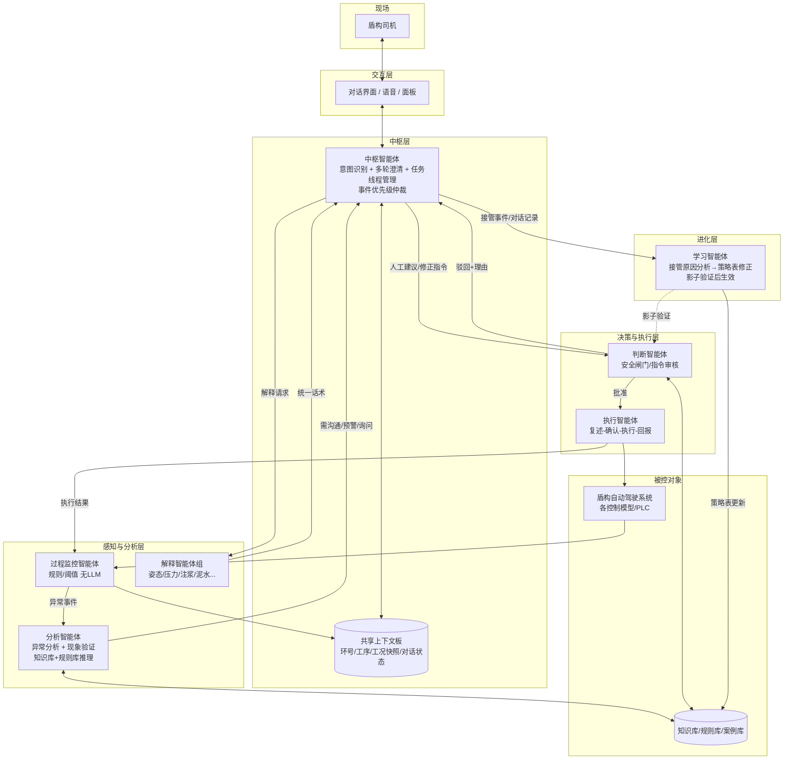

# 盾构自动驾驶人机协作多智能体系统设计文档

> 面向盾构机自动驾驶系统与现场监管司机之间的沟通、协作与控制水平提升。
> 交互可由司机发起（告知、评价、建议、询问），也可由助手发起（异常告警、核对问询、切人工问询）。

---

## 1. 系统总体架构

### 1.1 设计模式

采用 **"中枢智能体（Orchestrator）+ 专职智能体（Worker）"** 模式：

- 中枢智能体是与司机对话的**唯一出入口**，统一管理意图识别、多轮澄清、任务线程与事件优先级仲裁；
- 各专职智能体分工明确：监控感知、分析诊断、解释翻译、安全裁决、指令执行、离线学习；
- 通过**共享上下文板（Blackboard）**同步工况快照（环号、里程、工序、参数状态）与对话状态。

### 1.2 架构图



### 1.3 边界原则

- 只有**中枢**对司机说话；只有**执行**碰控制系统；只有**判断**能放行指令；
- **监控**只感知不推理，**分析**只推理不下发，**学习**只离线不在线；
- 所有驳回给理由、所有执行有回报、所有裁决可追溯（审计日志）。

---

## 2. 智能体功能定位与描述

| 智能体 | 定位 | 功能描述 | 输入 | 输出 | 技术形态 | 覆盖情境 |
|---|---|---|---|---|---|---|
| **中枢智能体** | 人机对话唯一出入口、任务编排中心 | ① 司机发起：三级意图分类（大类→对象→具体项）、低置信度多轮澄清；② 助手发起：事件路由、优先级仲裁（安全>故障>控制变更>评价询问）、播报话术生成；③ 任务线程管理（中断/挂起/恢复/抢占）；④ 维护共享上下文板 | 司机消息、各智能体的事件/结论/解释 | 分类结果+任务分发、对司机的统一话术 | LLM + 意图分类模型 + 状态机 | 全部（1–12） |
| **过程监控智能体** | 系统"哨兵"，实时确定性感知 | ① 系统健康监测（通讯心跳、模型运行、数据读写）；② 掘进参数越限/漂移检测；③ 指令执行效果验证（实际值 vs 目标值）；④ 输出结构化事件（类型、级别、涉及系统、数据快照） | PLC/传感数据流、执行智能体的下发记录 | 结构化异常/效果事件 | 规则+阈值+统计，**无LLM**，毫秒级 | 1, 2, 3, 9, 11 |
| **分析智能体** | 系统"诊断师"，异常分析 + 现象验证 | ① 异常分析：结合知识库/规则库判定自愈类/观察类/必须人工核对类，输出静默/预警/询问三档；② 现象验证：对司机报告的现象（异响、渗漏、出土异常、管片变形等）调取数据交叉验证真伪、定位关联系统、评估影响范围；③ 因果关联：检测反馈与掘进参数的因果推理，必要时生成参数调整建议；④ 对司机建议进行数据依据核实 | 监控事件、司机报告的现象/建议（经中枢转发）、知识库/规则库 | 分析结论、沟通必要性等级、验证报告、调整建议 | LLM推理 + 知识库检索(RAG) + 规则引擎 | 1, 2, 4, 5, 8, 10, 11 |
| **解释智能体（组）** | 控制策略"翻译官"，可解释性出口 | ① 按控制域分设（姿态/压力/切削/注浆/泥水/尾脂…），基于机器学习解释方法（特征归因、反事实等）说明控制动作的策略过程与原因；② 统一表达层归一为司机可懂话术（结论先行、带数据、不堆术语）；③ 不直接对人，结论交中枢转达 | 中枢的解释请求、控制模型内部状态/决策日志 | 归因解释、策略说明 | ML解释方法(SHAP/反事实等) + LLM表达层 | 7, 8 |
| **判断智能体** | 安全闸门、指令裁决者 | ① 双向审核：人工指令/建议与AI生成建议一律过审；② 依据规则库硬约束（参数区间、工序互锁、变化速率）+ 案例相似度裁决；③ 批准→转执行；驳回→必须给理由，经中枢向司机解释；④ 全部裁决留痕；⑤ 参与学习产出的影子验证审核 | 分析智能体建议、司机指令（经中枢）、规则库/案例库 | 批准/驳回+理由、审计记录 | 规则引擎为主 + LLM辅助案例比对 | 5, 6, 8, 9, 10, 12 |
| **执行智能体** | 指令落地的"操作手" | ① 四步确认回路：复述→司机确认→下发→回报结果；② 控制模式切换（启停模型、切人工/巡航）、参数目标/约束修改的实际下发；③ 支持超时回滚与执行中止；④ 下发记录同步监控智能体闭环验证 | 判断智能体批准的指令 | 下发动作、执行回报 | 接口适配 + 事务管理，无LLM或轻量LLM | 5, 6, 8, 9, 11 |
| **学习智能体** | 系统"进化引擎"，离线优化 | ① 分析人工接管原因、判断驳回案例、对话记录，归纳失效模式；② 修正策略表/权重，产出**必须经影子模式/离线仿真验证 + 人工审核**后生效，绝不在线直改；③ 反哺中枢：补充意图分类 few-shot 样本、优化澄清话术；④ 沉淀新案例进知识库 | 接管事件、驳回案例、对话与执行历史 | 策略表修正提案、分类样本、知识库更新 | 离线LLM分析 + 仿真验证管线 | 3, 12 |

---

## 3. 应用情境与运作流程

| # | 情境类别 | 发起方 | 典型例子 | 智能体流程 | 关键动作 |
|---|---------|-------|---------|-----------|---------|
| 1 | 系统故障告警 | 助手 | 通讯中断、模型不工作、数据写入失败 | 监控→分析→中枢→司机 | 监控抛事件；分析定级（自愈/预警/必须核对）；中枢按优先级播报，安全类抢占当前对话线程 |
| 2 | 异常检测核对 | 助手 | 姿态异常移动、参数漂移需现场确认 | 监控→分析→中枢⇄司机→(记录) | 分析生成核对问题清单；中枢带数据快照向司机问询；结果写入上下文板 |
| 3 | 切人工问询 | 助手 | 司机切换人工模式 | 监控→中枢⇄司机→学习 | 中枢询问接管原因并分类；对话记录+原因交学习智能体离线分析 |
| 4 | 故障上报 | 司机 | "螺旋机有异响"、"尾部渗漏" | 中枢(意图分类+澄清)→分析(现象验证)→中枢→司机 | 分析调取相关数据验证现象、评估影响；中枢反馈验证结论及建议 |
| 5 | 现场特殊操作告知 | 司机 | 换刀、开仓检查、监测换台 | 中枢→分析→判断→执行 | 分析判断对自动驾驶的影响；判断审核后执行智能体调整控制模式（如暂停某模型） |
| 6 | 控制目标修改 | 司机 | 修改姿态目标、推速区间、约束范围 | 中枢(澄清)→判断→执行→监控 | 中枢澄清具体参数与数值；判断按规则库硬约束审核；批准→执行(复述-确认-下发-回报)；驳回→中枢解释理由 |
| 7 | 控制策略质疑/不理解 | 司机 | "为什么刀盘转速降了？"、"纠偏太慢" | 中枢→解释→中枢→司机 | 解释智能体组生成归因解释；中枢统一话术反馈；若司机仍不满→转情境8 |
| 8 | 司机提控制建议 | 司机 | "建议加大注浆量" | 中枢→分析(验证依据)→判断→执行 或 驳回解释 | ���析验证建议的数据依据；判断审核安全性；采纳→执行并回报；不采纳→中枢给理由，记录到学习智能体 |
| 9 | 进度调整 | 司机 | 暂停/提速/降速 | 中枢→判断→执行→监控 | 快通道：分类明确、审核简单；执行后监控闭环确认 |
| 10 | 检测反馈 | 司机 | 管片变形、管片漂移、地面巡检结果 | 中枢→分析(关联验证)→判断→(执行/记录) | 分析关联掘进参数评估因果；必要时生成参数调整建议走判断→执行链 |
| 11 | 执行效果闭环 | 系统内部 | 任何指令执行后 | 执行→监控→分析→(中枢) | 监控验证实际效果；未达预期→分析→中枢向司机通报 |
| 12 | 离线学习 | 系统内部 | 定期/接管事件积累后 | 学习→(影子验证)→判断→知识库 | 修正策略表/权重、补充意图分类样本；影子模式验证+人工审核后生效 |

**共性规则**：中枢是与司机对话的唯一出入口；所有指令下发必经判断智能体；所有执行结果必回监控闭环；所有驳回必须给理由。

---

## 4. 意图分类与关键数据提取方案

### 4.1 总体思路

分类 + 槽位提取一体化，两级架构：

```
司机话语 → [一级：快速粗分类] → [二级：细分类 + 槽位提取(联合)] → [三级：澄清补全] → 任务分发
```

分类和数据提取**不分成两个独立模型**，用 LLM 一次输出"意图 + 槽位 + 置信度"的结构化 JSON，缺失槽位由中枢追问补全。

### 4.2 三级意图标签体系（归一化）

| 一级（大类，8个） | 二级（对象） | 三级（具体项） |
|---|---|---|
| 故障 | 系统 / 通信 / 软件 / 模型 / 传感 | 切削系统、心跳信号、姿态模型、出土称重… |
| 异常现象 | 设备 / 土仓 / 出土 / 尾部 | 异响、异物、油脂溢出、渗漏… |
| 现场操作 | 常规工序 / 校准维修 / 控制变更 / 检测反馈 | 换刀、开仓、切人工、启停{模型}… |
| 控制评价 | 掘进参数 / 控制目标 | 刀盘扭矩、高程姿态… |
| 控制要求 | 被控目标 / 策略设置 / 掘进参数 / 指令控制 | 姿态目标、总推力约束区间、注浆量… |
| 进度 | —— | 暂停 / 提速 / 降速 |
| 检测反馈 | —— | 管片漂移、管片变形、地面巡检 |
| 系统使用 | 智能助手 / 操作面板 / 智控软件 | —— |

要点：

- 去重原分类表中重复项（如采集中台出现多次）；
- `{系统}`、`{模型}` 做成**参数化占位符**，实体词典统一维护，避免标签爆炸；
- 一级分类同时映射**任务路由**：故障/异常→分析智能体验证；控制要求/进度→判断→执行；控制评价→解释智能体；
- 增加两个兜底类：`闲聊/无关`、`不明确`（触发澄清）。

### 4.3 分类实现：混合策略

| 层 | 方法 | 作用 |
|---|---|---|
| 规则层 | 关键词/正则 + 实体词典（盾构术语表：刀盘、切口压力、尾脂…） | 高频明确表述秒回（"暂停"、"切人工"）；安全词强制路由 |
| 模型层 | LLM few-shot / 微调小模型，输出三级标签+置信度 | 处理口语化、方言化、多意图表述 |
| 澄清层 | 置信度 < 阈值（如0.7）或标签冲突 → 中枢追问 | "您说压力偏高，是指切口压力还是排泥泵压力？" |

**多意图处理**：一句话可能含多个意图（"我要换刀，先把掘进停了"→ 现场操作+进度），LLM 输出意图**列表**，中枢按优先级排任务线程。

### 4.4 槽位（关键数据）提取

#### 按一级意图定义槽位模板（Schema）

| 意图大类 | 必填槽位 | 选填槽位 |
|---|---|---|
| 故障 | 涉及系统/部件、现象描述 | 发生时间、持续性、严重程度 |
| 异常现象 | 现象类型、位置 | 时间、伴随参数变化 |
| 现场操作 | 操作类型、涉及对象 | 预计时长、是否需暂停掘进 |
| 控制评价 | 评价对象（参数名）、评价倾向（偏高/偏低/波动/不满意） | 期望方向 |
| 控制要求 | 参数名、**目标数值/区间、单位** | 生效时机（本环/下环）、原因 |
| 进度 | 动作（暂停/提速/降速） | 幅度、原因、时长 |
| 检测反馈 | 检测对象、结果描述 | 环号/里程、数值 |

#### 结构化输出示例

```json
{
  "intents": [{
    "level1": "控制要求",
    "level2": "指令控制",
    "level3": "注浆量",
    "confidence": 0.92,
    "slots": {
      "参数名": "同步注浆量",
      "目标值": {"value": 6.5, "unit": "m³", "type": "绝对值"},
      "生效时机": null,
      "原因": "地面沉降偏大"
    },
    "missing_required": ["生效时机"]
  }]
}
```

#### 提取实现要点

- **数值归一化**：口语数值处理是盾构场景重点——"两毫米八"→2.8、"加两方浆"→+2m³（相对值）、"三公斤"→0.3MPa（现场习惯单位换算表）；区分**绝对值 / 相对增量 / 区间**三种类型；
- **实体链接**：槽位值必须落到系统内标准点位表（"螺旋机"→`screw_conveyor`，"切口压力"→`cutterhead_pressure_P1`），无法链接的实体触发澄清；
- **上下文继承**：多轮对话中槽位从上下文板继承（上一句说"注浆"，这句只说"改成6方"，参数名从上文补），环号/工序默认取当前工况快照；
- **必填槽位缺失 → 中枢定向追问**：每次只问一个最关键缺失项，最多追问 2 轮，仍不清则转人工复述确认。

### 4.5 闭环迭代与验收指标

**闭环迭代**：

- 澄清对话记录、司机纠正记录 → 学习智能体 → 补充 few-shot 样本 / 微调数据 / 词典新词；
- 上线初期规则层覆盖高频安全指令保底，模型层灰度放量；
- 每类意图保留混淆矩阵评估，优先修复分错到"执行链"（控制要求/进度）的高风险误分类。

**验收指标建议**：

| 指标 | 目标 |
|---|---|
| 一级分类准确率 | > 95% |
| 三级分类准确率 | > 88% |
| 必填槽位提取 F1 | > 90% |
| 平均澄清轮次 | < 1.5 |
| 安全类指令漏分 | 0 |

---

## 5. 附录：原始意图分类明细（待归一化清单）

原始分类表包含：故障（系统/通信/软件/模型/传感各细项）、现场操作（常规工序/校准维修/控制变更/检测反馈）、异常（设备异响、土仓异物、出土状态、油脂溢出、尾部渗漏）、进度（暂停/提速/降速）、控制评价（掘进参数/控制目标）、控制要求（策略设置/被控目标/掘进参数/指令控制）、系统使用（智能助手/操作面板/智控软件）等，详见 4.2 节归一化后的三级标签体系。
